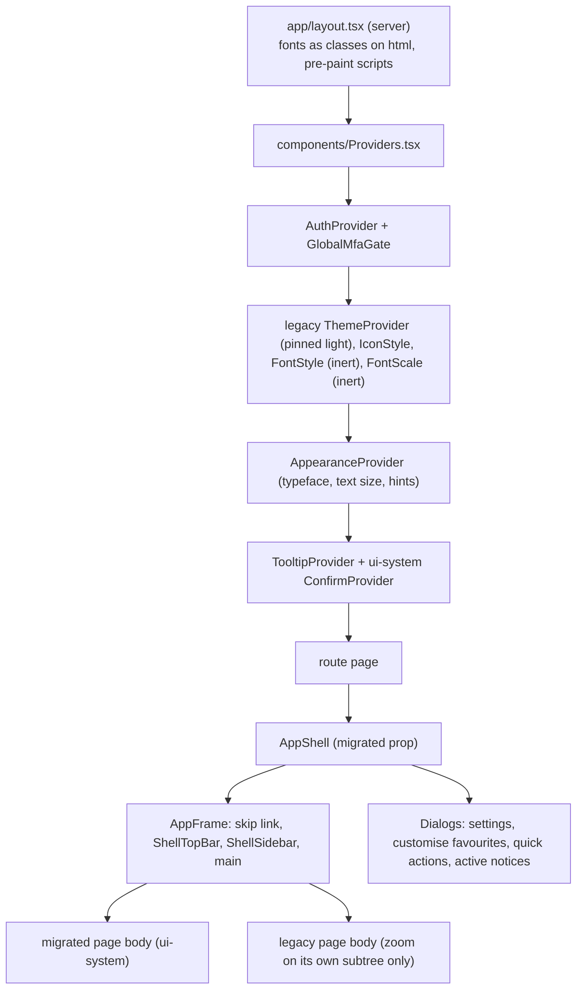

# Frontend UI architecture

**Status:** active architecture. Rewritten 3 Oct 2026 for the single-appearance redesign (the earlier text described the
retired light/dark and Classic/Dallaglio model).
**Scope:** all MyOffice frontend routes.
**Related:** component contracts in [`components/ui-system/README.md`](../components/ui-system/README.md); current work in
[`CURRENT_HANDOFF.md`](./CURRENT_HANDOFF.md); per-route status in [`MIGRATION_LEDGER.md`](./MIGRATION_LEDGER.md).

## Decision

MyOffice uses one layered, open-code UI system derived from the Tools & Equipment workspace:

1. **Radix UI** supplies accessible interaction primitives (dialog, popover, select, menu, tabs, tooltip, alert dialog).
2. **`components/ui-system/`** is the owned design system built on Radix, Tailwind 4 and semantic CSS variables. It is the
   only system new work uses.
3. **`components/app-shell/`** is the application chrome (top bar, sidebar, settings, notifications, feedback, account)
   composed from the system. It is application code, not part of the system.
4. **`components/shared/design-system/`** is the *legacy* system (Classic/Dallaglio, `${t.*}` tokens). It still renders the
   bodies of the unmigrated routes and is deleted route by route. Do not extend it.
5. `/tools` keeps its own CSS module and layout; it is the visual reference, and its tokens are bridged
   (`--brand` reads `--mo-action`).

**One appearance.** There is no theme switch. Reasons: Tools has none and is the standard; two appearances doubled every
verification matrix; the dark theme washed structure in violet. Consequence: the legacy `ThemeProvider` is pinned to
light + Dallaglio-neutral and ignores stored preferences; `.dark` is never applied. Reversing this means redoing the
palette contrast work for a second surface set.

Do not add Material UI, Chakra, Ant Design or another component framework unless an accepted decision names a capability the
stack cannot provide.

## How the pieces compose

`AppShell` provides `useAppShellState()` (favourites, quick actions, sidebar, search query) through `AppShellContext`.
The top bar always shows search, **Feedback**, notifications, settings and the account menu; there is no bottom bar.

## Shell structure and responsive rules

`AppFrame` is a sticky full-height sidebar column (216 px expanded, 68 px collapsed) beside a content column whose sticky
`TopBar` carries search, feedback, notifications, settings (spanner) and the account menu. The sidebar has a spotlight
pill, a bordered nav panel with Hide/Show, and `Shell` button variants (`shell` variant and size) that match Tools.
At 820 px and below it becomes a 57 px strip plus a drawer (focus returns to the opener). The breakpoint is 821 px; write
overrides mobile-first (`min-[821px]`) because Tailwind 4 `max-*` is exclusive. Safe areas come from `--mo-safe-*`
(`viewportFit: cover`). Under a coarse pointer every nav row and shell control is at least 44 px (`pointer-coarse:`).
Checked by `scripts/verify-shell-parity.mjs`. Service worker and update behaviour: [PWA_UPDATES.md](./PWA_UPDATES.md).

## CSS layering (`app/globals.css`)

Order matters because later `@theme` entries win and unlayered legacy rules beat Tailwind utilities:

1. Tailwind and `tw-animate-css`, then the legacy bases (`studio.css`, Dallaglio palette, `tools-theme.css`).
2. `ui-system/foundations/tokens.css`, `theme.css`, `base.css` (the new tokens, the Tailwind bridge and element defaults).
3. Legacy `@theme` entries for `--font-sans` and `--radius-*` were **removed** so the system owns them; `--font-active` is
   bridged to `--mo-font-body` for CSS that still reads it; legacy body/heading rules were deleted in favour of `base.css`.
4. `dallaglio/palette.css` forces every heading to weight 350 with high specificity. Headings carrying the shared
   `.font-display` class are exempt (`:not(.font-display)`), otherwise migrated pages and dialog titles rendered too light.

Text size is `--mo-text-scale` on `<html>` (85 to 130 per cent), read inside every `--text-*` theme value, so portals inherit it.
`APPEARANCE_BOOTSTRAP` (inlined in `<head>`) sets it before first paint.

## State ownership

| State | Owner | Notes |
|---|---|---|
| Typeface, text size, helpful hints | `AppearanceProvider` (`myoffice_appearance_v1`) | Migrates from Tools prefs and legacy `oz_*` keys once |
| Favourites, quick actions, sidebar collapsed | `useAppShellState` (`oz_*` keys) | Per device |
| Default module view, "start sections expanded" | `lib/prefs.ts` | Edited in the settings dialog |
| View mode per module | `useViewPreference` (`myoffice_view_*`) | Per device |
| Server data | page hooks, most via `lib/useApiList.ts` | Honest states; see `DataRegion` contract |
| Session and role | `lib/auth-context.tsx` | Role checks (`isAtLeast`) run on the client; the API enforces permissions |

## Failure and loading behaviour

A failed request is never shown as an empty list. `deriveDataStatus` (pure, tested) and `DataRegion` decide between
loading, retrying, refreshing, stale-error, unauthorized, error, empty and ready. Create/edit dialogs stay open with the typed
values and show the server message on failure. The notification bell reports a failed source instead of "nothing new"
(`useNotifications().failed`). Charts and heatmaps carry a text alternative.

## Accessibility behaviour that is part of the contract

Skip link as the first Tab stop; `main` is `tabIndex=-1`; the sidebar is a persistent landmark on desktop and a Radix drawer
below `lg` (focus trap, Escape, focus return); `aria-current="page"` on the active destination; `aria-pressed` on toggles
and filters; icon-only controls require a label; status is never colour alone; touch targets grow under `pointer: coarse`.
Verified by the harness listed in [`TESTING.md`](./TESTING.md) at 1440, 820, 390 and 320 px; reduced motion and
screen-reader passes are **not yet verified**.

## Verification contract

Any shared-component or theme change requires: focused unit/interaction tests; `tsc` and ESLint on touched paths; `npm run
docs:check`; a production build when the shell, CSS or providers change; and rendered verification at desktop and phone
widths with the screenshots actually inspected. A migrated route additionally needs a route spec
(`scripts/route-specs/`) and a dated entry in `migration-verification.json`.

## Primary references

- shadcn/ui documentation and theming: https://ui.shadcn.com/docs
- Radix Primitives: https://www.radix-ui.com/primitives/docs/overview/introduction
- Tailwind CSS 4 theme variables: https://tailwindcss.com/docs/theme
