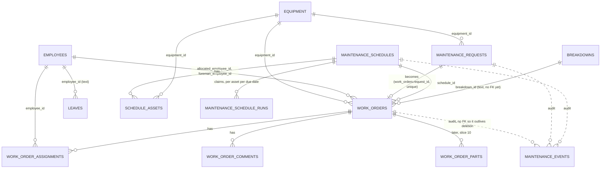
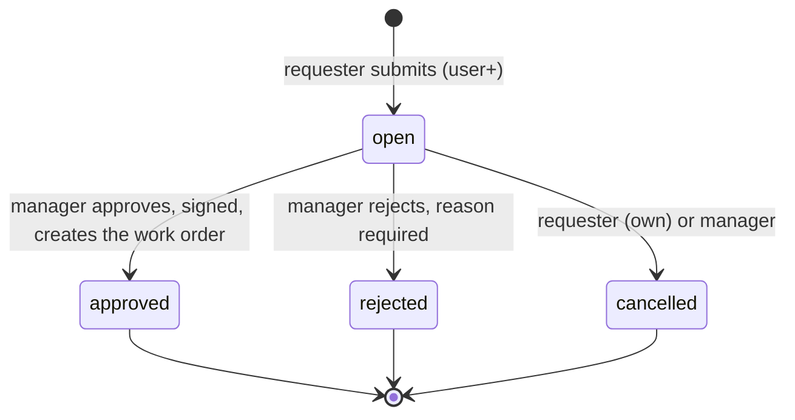
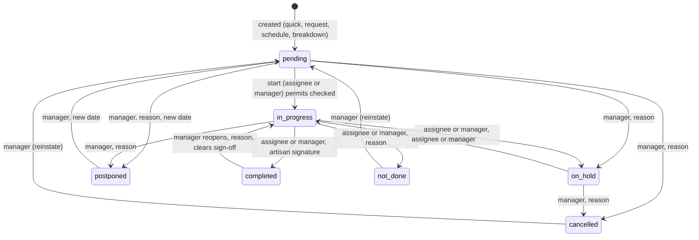

# Maintenance workflow rebuild: analysis and design

**Status:** Phase 0 (analysis and design) only. Nothing in this document is built. No existing file was changed.
**Date:** 6 Oct 2026.
**Audience:** the owner (for approval), then the developers and agents who build each slice.
**Related:** [CURRENT_HANDOFF.md](../CURRENT_HANDOFF.md) (project state), [UI_ARCHITECTURE.md](../UI_ARCHITECTURE.md), [ENGINEERING_STANDARDS.md](../ENGINEERING_STANDARDS.md), [WORK_ORDERS.md](../WORK_ORDERS.md) (status semantics today), [PAGE_PATTERNS.md](../PAGE_PATTERNS.md), [the UI system contract](../../components/ui-system/README.md), [DOCUMENTATION_STANDARD.md](../DOCUMENTATION_STANDARD.md).
**Backend draft migration (not applied):** `supabase_migration_maintenance_workflow_DRAFT.sql` in the `myofficebackend` repository, on branch `plan/maintenance-migration`.

## 0. How to read this document, and what was and was not inspected

The parts follow the brief in order: **R** requirements, **M** model, **F** functions, **W** wireframes, **P** prototype plan, **T** test and release plan, **D** delivery plan, **Q** open questions. Requirement numbers (R1, R2, ...) are the thread: every table, endpoint, screen and test below names the requirements it serves, and section D.2 is the traceability matrix.

**Principles used, named where they are applied** (the owner's list, shortened to tags used in the text):
`TRACE` traceability, `SOC` separation of concerns, `DRY` single source of truth and reuse before inventing, `VALIDATE` validate at the boundary and enforce on the server, `LEAST` least privilege and a role check on every write, `IDEM` idempotent and safe to retry, `NOSILENT` no silent failure, `AUDIT` who, when, what, signed where approving, `CONC` concurrency safety, `COMPAT` backward compatibility and reversible migrations, `SMALL` small independently shippable increments, `TEST` testability, `A11Y` accessibility, `DEEP` depth on in-scope features. Section 0.3 lists where a principle was deliberately not applied.

### 0.1 What was read

Frontend: `app/maintenance/*` (read in full: `page.tsx`, `types.ts`, `meta.ts`, `api.ts`, `useMaintenanceData.ts`, `WorkOrderDetail.tsx`, `ForemanSignoff.tsx`, `MachinePicker.tsx`, `SignOffField.tsx`; read in part, the first screens only: `WorkOrderForm.tsx`, `ArtisanReportForm.tsx`, `ScheduleForm.tsx`, `SchedulesView.tsx`, `helpers.ts`; not read: `AnalyticsView.tsx`, `phrases.ts`, `PhraseField.tsx` and the tests), `components/shared/PersonInput.tsx`, `SuggestField.tsx`, `PredictiveInput.tsx`, `hooks/useLookups.ts`, `lib/useApiList.ts`, the ui-system README and `patterns/` folder listing, and the docs `CURRENT_HANDOFF.md`, `UI_ARCHITECTURE.md`, `DOCUMENTATION_STANDARD.md`, `WORK_ORDERS.md`.

Backend: `app/routers/maintenance.py` (models, list, create, patch, delete), `schedules.py` (whole), `leaves.py`, `employees.py` (model), `equipment.py` (model), `breakdowns.py` (create), `signatures.py`, `issues.py`, `job_cards.py`, `condition_monitoring.py`; `app/auth.py` (role order); the migrations for schedules, services stage signatures, leaves working days, work-order classification, and the `schema_migrations` tracker.

### 0.2 What was NOT read, so claims about it are marked as assumptions

`failure_modes.py` fields, `lubrication.py`, `documents.py`, `compliance.py`, `availability.py` and `breakdowns.py` analytics beyond create (MTBF/MTTR figures are reused by reference, not re-derived), `app/stock_levels.py` internals, `lookup_lists.py`, `requisitions.py` beyond its route list, the Next.js documentation bundled in `node_modules/next/dist/docs/` (`node_modules` is not installed in this session, and `AGENTS.md` says this Next.js has breaking changes: the route structure in section F.3 must be confirmed against it before Phase 1), the base DDL of `work_orders`, `equipment`, `employees` and `leaves` (it is not in either repository; only add-column migrations are), and the live database. Where a plan item depends on one of these it says so, and the matching question is in section Q.

**Budget.** The brief says to stop and report if more than about 40 files are needed. The count came to roughly 40 to 45 files, but most were read in part only (a header, a line range, the model classes, or a search for route names). This is reported to the owner in the hand-off message rather than hidden.

### 0.3 Where a principle was deliberately not applied

- `DRY` is relaxed for the existing comma-separated machine list (`equipment_info`) and the text columns `allocated_to`, `authorising_foreman`: they stay next to the new id columns for `COMPAT` (about a dozen other pages read them). The id column is the truth when set; the text is the display value and the free-text provision.
- `SMALL` is relaxed for slice 3 (lifecycle): status rules, signatures and the database function belong together; splitting them ships a half-enforced state machine.
- `CONC` is not applied to comments (append-only, no edit) or to the leave register itself (owned by the leave module).
- `LEAST` is applied in two steps (section F.1.1): the first release logs refused-by-new-rules writes in shadow mode before enforcing, because tightening `PATCH /work-orders` for every signed-in user could stop artisans mid-shift.
- `TEST` for visual correctness: unit tests and route specs do not prove the rendering is right. Each UI slice records a manual look (as the handoff already requires), and real-device checks are listed as not covered.
- No offline mode (section R.4): a lost network is handled by retry and unsent drafts, not by a local database.

---

## R. REQUIREMENTS

### R.1 Actors

| Actor | Who they are in MyOffice terms | Role in the app today (`app/auth.py` order: viewer, user, manager, admin, super_admin) | What they need from this module |
|---|---|---|---|
| Requester | A person in another department (production, safety, stores) | `user` | Ask for work, say which machine, see whether it was approved and how it is going, give feedback when done |
| Foreman | Engineering foreman or supervisor | `manager` (assumption A1) | Receive requests, approve or reject with a signature, assign people, sign off finished work |
| Artisan | Fitter, electrician, boilermaker and so on | `user` | See my jobs, start, record time, parts and findings, finish and sign |
| Planner | Engineering planner or section engineer | `manager` | Maintain schedules, balance the week, publish assignments, watch overdue |
| Store | Stores controller | `user` or `manager` (assumption A1) | Issue the parts a job needs; stock must fall when issued |
| Manager | Engineering manager | `manager` or `admin` | See the numbers, delete and reopen exceptions |
| Admin | System administrator | `admin`, `super_admin` | Roles, lookup lists; no operational privilege beyond manager in this module |
| Scheduler job | The server's own generation run (cron secret) | none (cron secret) | Raise work orders from due schedules |

Assumption **A1**: there is no `foreman` or `artisan` role in the application. The plan maps foreman, planner and manager to `manager`, and everyone else who signs in to `user`. Open question Q1 asks whether that is how people are actually set up.
Assumption **A2**: a signed-in user is linked to an employee by matching the sign-in email to `employees.email`. Nothing in the code read proves it. It matters for "my jobs", "own request" and "assigned to me" checks. Question Q2.

### R.2 User stories

**Work orders (main thrust a)**

1. As a foreman I open one list of all work orders, narrow it by status, type, section, machine, assignee and date, save the view and come back to it, so I can run the morning meeting from one screen.
2. As a foreman I raise a work order on the fly, from a machine on the floor, with four fields, so the job exists in under half a minute even on a poor connection.
3. As an artisan I raise a breakdown work order for a stopped machine, linked to the breakdown record, so downtime and the repair are one story.
4. As a foreman I assign an artisan, and the system refuses a person on approved leave and tells me the dates, so I never discover it on the day.
5. As an artisan on a phone I see my jobs, open one, start it, record hours, parts and the cause, and sign, with large targets and without losing what I typed if the network drops.
6. As a foreman I sign off finished work with my signature, and the work order records who signed and when.
7. As a manager I read the audit trail of any work order: who changed what and when, and who signed.
8. As a requester I give feedback on the finished job.

**Requests (b)**

9. As a requester in another department I submit a request, choosing the machine from the register, and see its status without phoning anyone.
10. As a foreman I see open requests, allocate a foreman, and approve with a signature; approval turns the request into a work order carrying everything, and the request shows the work order number.
11. As a foreman I reject with a reason the requester can read.
12. As a requester I withdraw my request while it is still open.

**Scheduled work (c)**

13. As a planner I define a schedule once: which machines (many), what to do, how often, how early to raise it, and when to skip.
14. As a planner I see the next dozen occurrences before saving, per machine, marked if suppressed or if the planned person is on leave.
15. As a planner I trust that the server raises each due occurrence exactly once, even if the job runs twice, and that nothing fails because a person is away (it is raised unassigned and shows in the scheduler).
16. As a planner I open a work order and see the schedule that raised it, and open a schedule and see everything it raised.

**Secondary**

17. As a planner I see people against days and drag unassigned or overdue work onto them, then publish the week (slice 9).
18. As a store controller I issue the parts a work order needs and stock falls once (slice 10).
19. As a manager I see PM compliance, schedule compliance, backlog, request counts, availability, MTBF and MTTR, filtered by machine (slice 11).

### R.3 Functional requirements

Each has an acceptance criterion (AC) a test can check. "Server" means the FastAPI backend.

**Work orders**

| # | Requirement | Acceptance criterion |
|---|---|---|
| R1 | The work order list is served in pages with server-side filters (status, priority, type, section, machine, assignee, scheduled date range, overdue, free text) and sort. The old unpaged response stays for existing consumers. | With 5,000 rows, `GET /work-orders/search?limit=25` returns 25 rows and a total; each filter returns exactly the matching set; `GET /work-orders` without parameters still returns the same bare array as before. |
| R2 | A person can save, name, reapply and delete filter combinations ("saved views"); presets exist for Mine, Overdue, Unassigned, Open breakdowns. | Reloading the page keeps the saved views; a preset applies the expected filters; a view is private to the browser in v1 (Q9). |
| R3 | A work order opens as a record with tabs: Basic info, Feedback, Assignments, Permits, Parts (slice 10), Comments, Audit trail. It shows status, type, section, scheduled, created and updated dates, and the parent schedule or request. | Each tab renders its own loading, failure and empty state; opening a work order from a failed list refresh still works from the loaded row. |
| R4 | On-the-fly creation needs only machine, what is wrong or to do, priority and type; all other fields default. A retried create returns the same work order. | `POST /work-orders/quick` with four fields returns 201 with a server-allocated number; the same `Idempotency-Key` sent twice returns the same id and creates one row. |
| R5 | A breakdown work order is created from a machine with type Breakdown, start time now, and is linked to the breakdown record. | The created row has `classification = 'breakdown'`, `started_at` set, `breakdown_id` set when a breakdown is chosen; the breakdown screen shows the work order number. |
| R6 | Status changes go through one server transition table (section M.4): only allowed moves, only by allowed roles, each recorded. A repeated identical request is a no-op. | Every disallowed move returns 409 `transition_not_allowed` with the allowed list; a user without the role gets 403; repeating a successful move returns 200 with no new audit row. |
| R7 | Assigning a person who is on approved leave on the work day is refused by the server, on every path that sets an assignee (assignment endpoint, work order create, patch, request approval, schedule generation excepted per R24). An archived employee is refused too. | `POST .../assignments` for a person with approved leave covering the day returns 409 `employee_unavailable` with the leave type and dates; a direct `PATCH allocated_to` with that person's name is refused the same way. |
| R8 | The interface shows availability for every person in a picker: people on leave are greyed with the reason and dates, never hidden; people with a pending leave request show a warning only. | In the picker, a person with approved leave is present, `aria-disabled`, with text such as "On annual leave, 12 to 19 Oct"; a person with pending leave is selectable with a warning. |
| R9 | A work order carries the permit checklist (permit to work, hot work, hazardous work, confined space, high-voltage switching, land disturbance and vegetation clearance, other with a label). A job that flags a permit cannot start until each flagged permit has a reference. | Moving to `in-progress` with a flagged permit lacking a reference returns 422 `permit_reference_missing` naming it (Q6 confirms the rule). |
| R10 | Feedback information: start time, repair hours, requester feedback. Repair hours default to finish minus start and can be overridden; the requester can add feedback after completion. | Completing with start and finish times fills `repair_hours`; the requester (own request) can PATCH `requester_feedback` once the work order is `completed`, not before. |
| R11 | Completion carries the artisan's signature; closure carries the foreman's. Each records the signing user and time. A completed work order without a foreman signature is shown as "awaiting sign-off". | After the artisan completes, `artisan_signed_by/at` are set; after foreman sign-off, `foreman_signed_by/at` are set and the work order shows "Signed off". No new status value is added. |
| R12 | Every create, change, transition, assignment, approval and deletion of a work order, request or schedule appends an audit event (actor, time, what changed, from and to status, signature on approvals). Events cannot be changed or deleted. | An UPDATE or DELETE on `maintenance_events` fails; each of the above actions produces exactly one event in a test; the Audit tab lists them in order. |
| R13 | Two people editing one work order cannot silently overwrite each other: a stale save is refused with the current row. | Two clients load version 5; the first saves (version 6); the second save returns 409 `version_conflict` containing the current row; the UI shows who changed it and keeps the second person's typing. |
| R14 | Comments on a work order, author and time recorded, append-only. | A comment appears in the Comments tab for another user after refresh; it cannot be edited. |

**Requests**

| # | Requirement | Acceptance criterion |
|---|---|---|
| R15 | Any signed-in user (`user` or above) can submit a request: requester (defaults to me), from department and section, machine (register or free text), description, priority, type, needed-by date. | A `user`-role account creates a request and gets number `REQ-nnnnn`; the same idempotency key returns the same request; a `viewer` gets 403. |
| R16 | Managers see an inbox of requests filterable by status and foreman, and can allocate a foreman. A requester sees only their own requests. | A `user` calling `GET /requests` gets only own rows; a `manager` gets all; allocating a foreman records an audit event. |
| R17 | Approving a request, with the approver's signature, creates the work order and marks the request approved in one atomic step, carrying machine, description, priority, type, requester and department. Retrying returns the same work order. Two approvers at once produce one work order. | Approving twice returns the same work order id; two simultaneous approvals yield one work order and one 409; the work order's `request_id` is the request. |
| R18 | Rejecting needs a reason the requester can read. | `reject` without a reason returns 422; the requester's view shows the reason. |
| R19 | A requester can cancel their own request while it is open; a manager can cancel any open request. | Cancel on `approved` returns 409; cancel on own `open` returns 200 and an event. |
| R20 | The requester can follow the resulting work order's status (read-only) from the request. | The request record shows the linked work order's number and current status. |

**Scheduled work**

| # | Requirement | Acceptance criterion |
|---|---|---|
| R21 | A schedule has many assets, each picked from the equipment register (free text allowed). | A schedule with three assets stores three `schedule_assets` rows; the form shows them as removable chips. |
| R22 | A schedule is also the work order template: type, section, permits, priority, estimated hours, instructions, planned person and foreman; plus lead time (days before due to raise), and suppression days. | Generated work orders carry these values; changing the schedule affects only future occurrences. |
| R23 | Before saving, a projection preview lists the next N occurrences (N and horizon chosen), per asset, flagging suppressed ones and a planned person on leave on that day. It writes nothing. | `GET /schedules/{id}/projection` and `POST /schedules/projection` (unsaved draft) return the same dates the generator would later raise (one shared function). |
| R24 | Generation raises one work order per asset per due date, exactly once however many times it runs, and never fails because the planned person is on leave: it raises the work order unassigned with `needs_assignment` and reports it. | Running generation twice raises each occurrence once; a person on leave yields an unassigned work order flagged `needs_assignment`; one failing asset does not stop the rest. |
| R25 | "Raise now" runs on the server, is idempotent for the same schedule and day, and reports per asset. | Pressing it twice the same day creates no duplicates; the response lists created and skipped assets with reasons. |
| R26 | A schedule can be paused and resumed; edits and pauses are audited and version-checked. | A stale edit returns 409; pausing records an event; a paused schedule generates nothing. |
| R27 | A work order shows its schedule (and request); a schedule shows the work orders it raised. | Both links open the other record. |

**Secondary**

| # | Requirement | Acceptance criterion |
|---|---|---|
| R28 | Meter-based triggers are deferred (no generic meter store was found). | Documented as out of scope until Q7 is answered; no UI shows a meter trigger. |
| R29 | Scheduler board: people as rows, days as columns, with a panel of unassigned and overdue work orders; assign by choosing a cell; leave days shown on the person's row; "publish week" marks the week's assignments published. | An assignment onto a leave day is refused; publishing is idempotent; unassigned and overdue counts match the list filters. |
| R30 | Parts on a work order: required and issued quantities per spare from the spares register; issuing goes through the existing issue path so stock falls exactly once. | Issuing 2 of a part reduces stock by 2; repeating the same issue request does not reduce it again. |
| R31 | Task library (reusable task: steps, labour, parts) is deferred and needs Q8. | Not built in this plan's first release. |
| R32 | KPI board: PM compliance, schedule compliance, backlog, request counts, availability, MTBF and MTTR with fixed written definitions and machine filter; availability, MTBF and MTTR come from the existing availability and breakdown analytics, not recomputed. | Each number has its numerator, denominator and period on screen on hover; figures reconcile with the filtered lists. |
| R33 | "My jobs": a saved view of work assigned to me, one tap from the Maintenance page, usable on a phone. | Selecting it shows only work assigned to the signed-in employee; works at 390 px with 44 px targets. |

**Cross-cutting**

| # | Requirement | Acceptance criterion |
|---|---|---|
| R34 | Machine, person, section and part fields pick from their register with type-ahead and Tab autofill; free text stays possible, never the default. Reuse `PredictiveInput` and the `Field` wrappers; no new autocomplete. | Typing "com" shows the matching machine as ghost text; Tab fills it and stores its id; typing something not on the register keeps the text and stores no id; a field shows which of the two it holds. |
| R35 | Loading, failure and empty are three different states on every list and tab. | A route spec for each screen returns a 503 and expects the failure state, not the empty state; a slow response keeps "loading". |
| R36 | Every write endpoint checks a role on the server; the permission matrix in section F.1.1 is the contract. | A test per endpoint with a `viewer` and a `user` token asserts the documented status. |
| R37 | Creates are safe to retry (idempotency key or natural unique key). | Covered per endpoint in F.1. |
| R38 | Existing consumers keep working: the bare-array `GET /work-orders`, `POST /work-orders` body, `PATCH`, `/schedules` CRUD and `/schedules/generate`. | The existing backend tests and route spec for `/maintenance` pass unchanged after each slice. |

### R.4 Non-functional requirements

- **Performance on large lists.** The list page loads 25 rows per request, not the whole register (today `useApiList('/api/maintenance/work-orders')` downloads every row, cached 60 s on the server, and filters in the browser). Targets, to be measured not assumed: first 25 rows visible within 2 s on a warm server at 20,000 work orders; the leave check adds at most one indexed query per assignee; the scheduler week view is one request. Text search uses `ilike` without a trigram index at first; add one only if measurement shows it is needed (it needs an extension, an owner decision).
- **Slow or lost network.** Existing rule kept: a slow service keeps loading (`lib/transientRetry.ts`), a failure is never empty. New: creates carry an idempotency key so a retry cannot duplicate; the artisan report and the request form keep an unsent draft in the browser (per-viewer convenience only) and say "not sent" until the server answers; no offline queue (out of scope).
- **Audit.** Append-only event table; signed approvals keep the signature image beside the event, plus the signing user id taken from the verified sign-in, never from the request body.
- **Permissions.** Enforced on the server (`require_role`), then repeated in the UI only to hide buttons. Row-level security policies are defence in depth; the backend uses the service role and bypasses them, as it does for every other table.
- **Mobile use by artisans.** Phone width is a design input to every wireframe; 44 px targets on coarse pointers (the system already does this); one-hand primary actions in a sticky footer; no hover-only information.
- **Accessibility.** Everything uses the ui-system primitives, which carry the focus, dialog and table contracts; availability is communicated with text and not colour alone; the autofill ghost text has a listbox alternative and announces the suggestion.
- **Data retention.** Events, requests and work orders are not purged by this plan. Deleting a work order stays manager-only and writes a final event; its comments and assignments go with it, its audit rows stay. A statutory retention period is Q11.
- **Reliability of generation.** Generation is idempotent by a database unique key and releases its claim if the work order insert fails (existing behaviour, kept).

### R.5 Assumptions

- A1, A2 above.
- **A3**: `leaves.employee_id` holds the same value as `employees.employee_id` (the readable identifier such as "C1165"), because both routers describe it so and the leave form is fed from the employee list. To be confirmed by one query before slice 2 (see the migration header).
- **A4**: `equipment.id` and `employees.id` are integer or bigint (the routers address them as `int`).
- **A5**: "suppression days" means: skip a due date that falls within N days after the asset's last completed work order from this schedule (avoids doing a service twice after an early breakdown repair). Q5.
- **A6**: the permit set in eMaint (observed) is the permit set MyOffice needs; the labels are editable text, the keys are fixed.
- **A7**: signature images are stored as data URLs, as they are for `artisan_sign`, `foreman_sign` and `services.stage_signatures` today. The server cannot prove the image was drawn by the signing user; it records the authenticated user id with it. The existing unlock-by-password flow (`signatures.py`) is what ties a saved signature to a person.

### R.6 Out of scope

Purchase orders, taxes, shipping addresses, projects and interactive plans (as instructed). Also: labour rates and cost charges, miscellaneous and service charges (MyOffice holds no rate cards; labour hours are kept as hours on assignments, not money), meter-based triggers (R28), the task library (R31, deferred), a native or offline mobile app, email or SMS notification (the existing bell and notices are the channel; a later slice may post to them), changes to the leave module, and moving `/tools` onto the design system (owner decision, 5 Oct 2026).

### R.7 Current-state gap analysis against the eMaint behaviour

| eMaint behaviour observed | MyOffice today | Gap and where the fix goes |
|---|---|---|
| Filterable table, saved views | `app/maintenance/page.tsx` filters in the browser over the whole register (`filterOrders` in `helpers.ts`); sort and priority chips; cards or table; no saved views; bulk action is delete only | Server paging and filters (R1), saved views (R2), more bulk actions (assign, change status through transitions) |
| Record with Basic, Feedback, Asset tabs | `WorkOrderDetail.tsx` is a dialog with three steps: request (read only), artisan report, foreman sign-off | Record with tabs (R3); the three existing steps become tabs, not rewritten |
| Job type, section, dates | `classification` (planned_maintenance, project, breakdown, custom), `to_section`, `date_raised`, `due_date`; no scheduled date; none of started/completed timestamps (only text times) | `scheduled_date`, `started_at`, `completed_at` (migration section 3) |
| Permit checklist | none | `permits` jsonb (R9) |
| Status badge, parent scheduled WO | status badge, overdue badge; no parent link; schedule-raised work orders carry text "Raised automatically from schedule #n" in `notes` | `schedule_id`, `request_id` columns and links (R27) |
| Assignments, labour requirements | one free-text `allocated_to`; `artisan_name`; `manpower` jsonb present in the model, unused by the UI | Assignments table (R7); labour hours as assignment hours |
| Part charges, requirements | `spares_used` jsonb edited with `SparesEditor`; does not reduce stock (only `issues.py` calls `adjust_stock`) | Parts table and issue path (R30, slice 10) |
| Procedures, task library | none; `job_cards` has `tasks` and `parts_used` (a parallel module) | Deferred (R31); see overlap note below |
| Documents, Comments, Audit Trail | none on work orders; no audit anywhere on work orders (`PATCH` takes `updated_at` from the client) | Comments (R14), audit (R12); Documents tab deferred until the documents router is read |
| Requests, approval converts to WO | none | R15 to R20 (new table and screens) |
| Scheduled WOs: triggers, many assets, template, lead time, suppression, projection | `maintenance_schedules` (one text list of machines, calendar recurrence, lead time as `advance_days`, no suppression, no preview); `schedules.py` generates **one** work order for the whole comma list, while "Raise now" in `SchedulesView.tsx` raises **one per machine**, numbering on the client | Many assets, per-asset generation, projection, suppression, server-side raise-now (R21 to R26). Fixes an existing inconsistency. |
| Scheduler (people x days, unassigned and overdue panel, publish all) | none | R29, slice 9 |
| Assets with hierarchy, criticality, meters | equipment register has `criticality`, `status`, `maintenance_interval`, no parent asset, no meters | Out of scope here (equipment register work); the work order uses the register as it is |
| Dashboard KPIs | `AnalyticsView.tsx` computes from the loaded work orders; availability and breakdown analytics live elsewhere; `REPORT_TARGETS` are placeholders (handoff section 7) | R32, slice 11; targets need the owner (Q10) |
| People on leave cannot be assigned | no check anywhere; `PersonInput.tsx` is a browser datalist of employee names | R7, R8 |
| No retyping | `MachinePicker.tsx` uses `Combobox` plus a typed-name field; `PersonInput` is a datalist with no id and no Tab autofill; section, department are plain inputs | R34 |
| Signatures on approvals | artisan and foreman signatures exist as images (`SignatureField`); the server records no signing user or time | R11, R17 |

**Overlap with `job_cards`:** `job_cards` (`app/routers/job_cards.py`) is a second module for the same real-world thing (title, equipment, type, priority, status, tasks, parts, labour hours, assigned_to, sign-off). This plan does not extend it and does not merge it: the owner asked to plan changes to existing modules, not a new one, and merging two live registers is a data decision. Recommendation in Q4: freeze `job_cards`, link nothing to it, and decide its retirement after slice 5.

**Reuse of the other registers:** `equipment` (pick machines, criticality), `employees` (pick people; `section`, `department`, `supervisor`, `archived`), `leaves` (availability), `breakdowns` (link, downtime), `condition_monitoring` (a reading with a bad `result` can open a prefilled request: a small later link, not a slice of its own), `spares` and `issues` (parts and stock), `requisitions` (parts shortage: link only), `signatures` (the signing flow), `failure_modes` (the cause list; `meta.ts` hard-codes 20 failure modes today, so the picker should read the register: `DRY`, folded into slice 3 once the router's fields are read), `lubrication` (not read; its tasks could become schedules, not planned here).

---

## M. MODEL

The SQL for everything marked **new** below is in the draft migration (`supabase_migration_maintenance_workflow_DRAFT.sql`, backend repository). It is not applied. It was checked only by running it twice, and its two database functions and its rollback block, against a throwaway local PostgreSQL 16 with stub tables standing in for the real ones. It has not been run against Supabase, and the real column types of `work_orders`, `equipment`, `employees` and `leaves` still have to be read from the live database (precondition queries are at the top of the file).

Design rules for the model: extend the existing `work_orders` table instead of replacing it (`COMPAT`, `DRY`); one new column per fact (no second place for the same fact); register links are nullable foreign keys with the text column kept beside them as display and free-text provision; every lifecycle fact (who, when) is a column or an event, never a guess from `updated_at`.

### M.1 Entity overview



### M.2 Tables

Legend: **PK** primary key, **FK** foreign key, **NN** not null, **UQ** unique. "Existing" columns are listed only where the plan depends on them.

#### M.2.1 `work_orders` (existing table; additions only)

| Column | Type | Null | Default | Notes | Req |
|---|---|---|---|---|---|
| `id` | integer/bigint (A4) | NN | serial | PK, existing | |
| `work_order_number` | text | NN | server | UQ (`uq_work_orders_number`, existing); allocated by `_generate_wo_number` with retry, existing | R4 |
| `status` | text | NN | `'pending'` | Values stay exactly: pending, in-progress, on-hold, postponed, completed, cancelled, not-done. **New** `CHECK ... NOT VALID` so only new writes are policed | R6 |
| `classification` | text | | | existing: planned_maintenance, project, breakdown, custom. This is eMaint's "type"; no second column | R3 |
| `to_section`, `from_section`, `to_department`, `from_department` | text | | | existing text; the plan fills them from the register but does not add id columns (sections come from a lookup list, Q12) | R15 |
| `equipment_info` | text | | | existing display text and free-text provision | R34 |
| **`equipment_id`** | bigint | | NULL | **FK** `equipment(id)` ON DELETE SET NULL; index | R34 |
| `allocated_to` | text | | | existing; keeps the lead's display name | R7 |
| **`allocated_employee_id`** | bigint | | NULL | **FK** `employees(id)` ON DELETE SET NULL; index. NULL means free text or unassigned | R7 |
| **`foreman_employee_id`** | bigint | | NULL | **FK** `employees(id)` ON DELETE SET NULL | R16 |
| **`scheduled_date`** | date | | NULL | the day the work is planned for | R3 |
| `due_date` | date | | NULL | existing | |
| **`started_at`**, **`completed_at`** | timestamptz | | NULL | set by the transition function, never by the client | R10 |
| **`repair_hours`** | numeric(8,2) | | NULL | CHECK >= 0; default computed from start and finish | R10 |
| **`requester_feedback`**, `_by` uuid, `_at` timestamptz | text, uuid, timestamptz | | NULL | feedback after completion | R10 |
| **`permits`** | jsonb | NN | `'{}'` | CHECK object. Keys fixed by the backend: `permit_to_work`, `hot_work`, `hazardous_work`, `confined_space`, `high_voltage_switching`, `land_disturbance`, `other`; each `{required: bool, reference: text, label?: text}` | R9 |
| **`needs_assignment`** | boolean | NN | false | set when generation could not assign (person on leave) | R24 |
| **`breakdown_id`** | text | | NULL | partial index; no FK until `breakdowns.id` type is confirmed | R5 |
| **`request_id`** | bigint | | NULL | **FK** `maintenance_requests(id)`; **partial UQ** where not null: the single truth for "request became this work order" | R17 |
| **`schedule_id`** | bigint | | NULL | **FK** `maintenance_schedules(id)` SET NULL; partial index | R27 |
| `artisan_sign`, `foreman_sign` | text | | | existing signature images (or legacy typed names) | R11 |
| **`artisan_signed_by`**, **`foreman_signed_by`** | uuid | | NULL | the verified user id of the signer | R11 |
| **`artisan_signed_at`**, **`foreman_signed_at`** | timestamptz | | NULL | | R11 |
| **`version`** | integer | NN | 1 | bumped by a database trigger on every UPDATE, by any writer | R13 |
| **`client_token`** | text | | NULL | partial UQ where not null; idempotency key of a create | R4 |
| `spares_used` | jsonb | NN | `'[]'` | existing; stays until slice 10 moves parts to a table, then becomes read-only history | R30 |

New indexes: `(status, due_date)`, `(scheduled_date)`, `(equipment_id)`, `(allocated_employee_id)`, partials on `breakdown_id`, `schedule_id`, `request_id`, `client_token`.

#### M.2.2 `maintenance_requests` (new)

| Column | Type | Null | Default | Notes |
|---|---|---|---|---|
| `id` | bigserial | NN | | PK |
| `request_number` | text | NN | `'REQ-'` plus a 5-digit sequence value | UQ; a database sequence, so concurrent creates cannot collide |
| `client_token` | text | | | partial UQ; idempotency |
| `status` | text | NN | `'open'` | CHECK open, approved, rejected, cancelled |
| `requester_user_id` | uuid | | | the signed-in user (from the token, never the body) |
| `requester_employee_id` | bigint | | | FK `employees(id)` SET NULL |
| `requester_name` | text | NN | `''` | display and free text |
| `from_department`, `from_section` | text | NN | `''` | |
| `equipment_id` | bigint | | | FK `equipment(id)` SET NULL |
| `equipment_text` | text | NN | `''` | CHECK: `equipment_id` or `equipment_text` present |
| `description` | text | NN | | CHECK non-blank |
| `classification` | text | | | CHECK planned_maintenance, project, breakdown, custom (same vocabulary as work orders) |
| `priority` | text | NN | `'medium'` | CHECK low, medium, high, urgent |
| `needed_by` | date | | | |
| `foreman_employee_id`, `foreman_text` | bigint, text | | | "allocated to a foreman" |
| `decided_by_user_id`, `decided_by_name`, `decided_at`, `decision_note` | uuid, text, timestamptz, text | | | CHECK: approved or rejected rows have decider and time; rejected rows have a reason |
| `version` | integer | NN | 1 | bumped by trigger |
| `created_at`, `updated_at` | timestamptz | NN | now() | `updated_at` by the existing `set_updated_at()` |

Indexes: `(status, created_at desc)`, `(requester_user_id, created_at desc)`, partial `(foreman_employee_id) where status='open'`. RLS: a requester reads their own rows; managers read all.

#### M.2.3 `work_order_assignments` (new, slice 7)

| Column | Type | Null | Default | Notes |
|---|---|---|---|---|
| `id` | bigserial | NN | | PK |
| `work_order_id` | bigint | NN | | FK `work_orders(id)` ON DELETE CASCADE |
| `employee_id` | bigint | | | FK `employees(id)` ON DELETE RESTRICT (a person with assignments cannot be hard-deleted; the employee module archives instead) |
| `employee_text` | text | NN | `''` | free-text provision; CHECK `employee_id` or `employee_text` present |
| `role` | text | NN | `'lead'` | CHECK lead, assistant |
| `planned_date` | date | NN | | the work day the leave rule is checked against |
| `planned_hours`, `actual_hours` | numeric(5,2), numeric(6,2) | | | CHECK > 0 and >= 0; labour hours are hours, not money (R.6) |
| `status` | text | NN | `'planned'` | CHECK planned, published, done, removed (removal is soft so history stays) |
| `published_at`, `assigned_by`, `created_at`, `updated_at` | | | | |

Constraints: one lead per work order (partial UQ where role='lead' and not removed); one row per person per day per work order (partial UQ); indexes on `(employee_id, planned_date)` and `(planned_date)` where not removed, which serve the scheduler and the clash query. Not enforced: a cap on hours per person per day (shown as load, warned, not blocked, because an overload is a planner's judgement).

#### M.2.4 `work_order_comments` (new)

`id` bigserial PK; `work_order_id` bigint NN FK CASCADE; `body` text NN CHECK non-blank; `author_user_id` uuid; `author_name` text NN `''`; `created_at` timestamptz NN now(). Index `(work_order_id, created_at)`. Append-only by convention (no update or delete endpoint).

#### M.2.5 `maintenance_events` (new, the audit trail)

| Column | Type | Null | Notes |
|---|---|---|---|
| `id` | bigserial | NN | PK |
| `entity` | text | NN | CHECK work_order, request, schedule, assignment |
| `entity_id` | bigint | NN | **no foreign key**: the trail must outlive a deleted row |
| `entity_number` | text | | WO-00012 or REQ-00004, copied |
| `action` | text | NN | created, updated, transition, approved, rejected, assigned, unassigned, published, signed_off, deleted, ... |
| `from_status`, `to_status` | text | | |
| `changes` | jsonb | NN `'{}'` | CHECK object; `{field: [old, new]}` for edits |
| `note` | text | | reason or comment |
| `signature` | text | | data URL, only on signed approvals and sign-offs |
| `actor_user_id` | uuid | | from the verified token |
| `actor_name` | text | | copied, so renaming a user does not rewrite history |
| `created_at` | timestamptz | NN | now() |

A trigger raises on UPDATE and DELETE (append-only); indexes `(entity, entity_id, created_at desc)` and `(actor_user_id, created_at desc)`. Tested against the local database: an update and a delete are both refused.

#### M.2.6 `maintenance_schedules` (existing; additions) and `schedule_assets` (new)

Existing columns used as they are: `name`, `equipment_info` (comma list, kept in step by the backend until slice 8 is fully rolled out), `to_department`, `allocated_to`, `authorising_foreman`, `estimated_hours` (text, kept), `job_request_details`, `job_instructions`, `priority`, `recurrence_type`, `recurrence_dow/dom/months`, `specific_dates`, `advance_days` (the lead time), `active`, `next_due_date`, `last_generated`.

New columns: `classification` text; `to_section` text NN `''`; `permits` jsonb NN `'{}'`; `allocated_employee_id`, `foreman_employee_id` bigint FK `employees(id)` SET NULL; `suppress_days` integer NN 0 CHECK >= 0; `version` integer NN 1 with the bump trigger.

`schedule_assets`: `id` bigserial PK; `schedule_id` bigint NN FK CASCADE; `equipment_id` bigint FK `equipment(id)` SET NULL; `equipment_text` text NN `''`; CHECK one of the two present; partial UQ `(schedule_id, equipment_id)` and `(schedule_id, lower(btrim(equipment_text)))` where `equipment_id` is null. An optional, re-runnable data step in the migration fills it from the existing comma lists, linking only when exactly one equipment row has that name (tested: a name that matches two rows stays unlinked).

`maintenance_schedule_runs` (existing) gains `equipment_key` text NN `''` (the asset's id or text) and `skipped_reason` text. Its uniqueness widens from `(schedule_id, due_date)` to `(schedule_id, due_date, equipment_key)`: the new unique index is created first, then the old constraint dropped, so idempotency is never absent. This is the one non-additive step; the rollback re-adds the old constraint only if no per-asset rows exist.

#### M.2.7 Later tables (modelled now, drafted in SQL only when their slice starts)

- `work_order_parts` (slice 10): `id` bigserial PK; `work_order_id` FK CASCADE; `stock_code` text (the key `issues.py` and `adjust_stock` already use); `spare_id` bigint FK spares SET NULL; `description` text NN; `qty_required` numeric(10,2) NN CHECK > 0; `qty_issued` numeric(10,2) NN 0 CHECK >= 0 and <= qty_required unless overridden by a manager; `unit_price` numeric(12,2) snapshot (display only); `issue_id` bigint (the `stock_issues` row); `issue_token` text UQ (idempotent issue). Issuing calls the existing `adjust_stock` path once per token.
- `maintenance_tasks` and `maintenance_task_steps` (slice 12, only if Q8 says yes): reusable task name, steps, planned hours, parts template; a work order or schedule copies from it (no live link, so editing the library never rewrites history).

### M.3 Relationships and ownership

- A work order is raised from nothing (on the fly), a request (`request_id`), a schedule (`schedule_id`), or a breakdown (`breakdown_id`); at most one of request and schedule applies. Source is derivable (no `source` column: `DRY`).
- The lead assignment mirrors `allocated_to` and `allocated_employee_id`; the backend writes both in one call; the existing readers keep working.
- A schedule owns its assets and its run log. Deleting a schedule deletes its assets and runs (existing cascade), keeps the work orders it raised (`schedule_id` set to null), as the delete confirmation already tells the user.
- Leave is read, never written, by this module.

### M.4 State diagrams

**Request**



**Work order** (the statuses are unchanged; "signed off" is a fact beside `completed`, not a new status)



Foreman sign-off is an action on a `completed` work order (`POST .../signoff`) that sets `foreman_signed_by/at` and appends a signed event. It is not a state change, so the existing statuses, filters, stats and `WORK_ORDERS.md` semantics stay valid (`COMPAT`).

| From | To | Who (server-enforced, `LEAST`) | Required input | What is recorded |
|---|---|---|---|---|
| (new) | pending | `user`+ for quick and breakdown work orders; `manager` for the full form, request approval, scheduler job | machine and description | event `created`; `client_token`; number |
| pending | in-progress | assignee or `manager` | permit references for flagged permits (R9) | `started_at` (first time), event |
| pending / in-progress / on-hold | on-hold, postponed, cancelled | `manager` (assignee may put own job on hold) | reason (and a new date for postponed) | event with reason |
| in-progress | completed | assignee or `manager` | artisan signature, start time; finish time defaults to now | `completed_at`, `artisan_signed_by/at`, `repair_hours` default, event with signature |
| in-progress | not-done | assignee or `manager` | reason | event |
| on-hold | in-progress | assignee or `manager` | none | event |
| postponed, not-done, cancelled | pending | `manager` | reason | event |
| completed | in-progress | `manager` | reason; clears the foreman sign-off (the old signature stays in the earlier event) | event |
| completed | (sign off) | `manager` | foreman signature | `foreman_signed_by/at`, signed event |
| any | (delete) | `manager` (existing rule) | confirmation | final event `deleted`; comments and assignments go with the row, the trail stays |

The transition table lives once, in a backend module (`app/maintenance_rules.py`, new), and is returned to the client as `allowed_transitions` on every work order, so the UI never keeps its own copy (`DRY`, `VALIDATE`). The database function only guarantees "applied once, to the version the caller saw".

### M.5 The leave-availability rule, as data and as logic

**Data (all existing, nothing new but one index).** `leaves`: `employee_id` text (A3), `start_date` date, `end_date` date, `status` pending, approved or rejected, `leave_type`, `exclude_weekends_holidays`. `employees`: `id`, `employee_id` text, `archived`, names. Index added: `leaves (employee_id, start_date, end_date) where status = 'approved'`.

**Logic.** For an employee and a work day range `[from, to]` (a single day for an assignment):

1. `archived` employee: **refused**, reason `archived`.
2. An `approved` leave with `start_date <= to` and `end_date >= from`: **refused**, reason `on_leave`, carrying the leave type and its full start and end dates (not only the overlapping day).
3. A `pending` leave overlapping: **allowed with a warning** (`leave_requested`), because an undecided request must not stop work (Q3).
4. Otherwise **available**.

The whole approved span counts, including weekends, even where `exclude_weekends_holidays` is true: that flag changes how days are counted for pay, not whether the person is away.

The work day is the assignment's `planned_date`; if the caller gives none, the work order's `scheduled_date`, then today. A due date alone is not a work day.

**Where it runs.** One backend function (`app/maintenance_availability.py`, new) used by every path that names an assignee: the assignment endpoint, quick create, work order create and patch (`allocated_to`), request approval and the scheduler's assign. A free-text name is resolved to an employee by exact, case-insensitive full name among non-archived staff: one match is treated as that person (so typing the name cannot bypass the rule), several matches are refused as ambiguous, none is allowed as free text and stored unverified. The leave request path is not changed.

**Not covered, said plainly.** If leave is approved after the person was assigned, the assignment is not removed (that would change a record the leave module's user did not see). `GET /api/maintenance/assignments/conflicts` lists future assignments that now overlap approved leave, the scheduler shows a banner, and the work order shows "Assigned person is now on leave". Schedule generation never refuses (R24).

---

## F. FUNCTIONS

Legend for **Reuse**: **existing** (unchanged), **extend** (additive change, old callers unaffected), **new**. Backend paths are under `/api`; `maintenance` endpoints are on the existing router `app/routers/maintenance.py` unless a file is named. `user+` means any role at or above `user` (`get_current_user` plus `role_at_least`); `manager` means `require_role('manager')`.

### F.1 Backend

#### F.1.1 Conventions that apply to every endpoint

- **Errors keep their real HTTP status** (`AGENTS.md`). A new error body is `{"detail": "<one human sentence>", "code": "<machine code>", "context": {...}}`: `detail` stays a string so the existing client keeps working; `code` and `context` are additive. Whether the frontend `ApiError` exposes the parsed body was not read; if it does not, Phase 1 adds a `body` field to `ApiError` (additive).
- **Codes used:** `version_conflict` (409, context carries the current row), `transition_not_allowed` (409, context lists allowed moves), `employee_unavailable` (409, context: employee, state, leave type, start and end dates), `employee_ambiguous` (422), `permit_reference_missing` (422), `forbidden_role` (403), `not_found` (404), `validation_failed` (422), `service_unavailable` (503, for an unreachable database, never turned into an empty success).
- **Idempotency:** creates accept `Idempotency-Key` (a UUID the form generates once per open form). Same key and same user returns the stored row with 200 instead of 201.
- **Optimistic concurrency:** edits carry the `version` the client loaded; a mismatch is 409 `version_conflict`. A write that omits `version` is accepted in the first release and logged (shadow mode) so existing callers are not broken, then required once the UI always sends it (`COMPAT`, `CONC`).
- **Actor:** the signing, approving or commenting user comes from the verified token (`get_current_user`), never from the body.
- **Audit:** every write below appends a `maintenance_events` row through one helper (`app/maintenance_events.py`, new). For lifecycle changes and approval the event is written inside the database function, in the same transaction.
- **Shadow mode for new role rules** (first release of slice 3): a write the new rules would refuse but the old behaviour allowed is performed, and logged with `shadow_refusal`; the next release enforces. This is the deliberate relaxation of `LEAST` named in 0.3.
- **Layering** (`SOC`): router (parse, authorise, map errors) calls a service module (`app/maintenance_service.py`: business rules, uses `maintenance_rules.py` for the transition table and `maintenance_availability.py` for leave), which calls data access (Supabase calls only). New code does not put rules in route handlers.

#### F.1.2 Work orders

| Method and path | Request | Response | Validation | Permission | Errors | Reuse | Req |
|---|---|---|---|---|---|---|---|
| `GET /maintenance/work-orders` | existing filters, `limit` | bare array (unchanged) | existing | `user+` | 500 | existing | R38 |
| `GET /maintenance/work-orders/search` | `q`, `status` (repeatable), `priority`, `classification`, `section`, `equipment_id`, `assignee_id`, `source` (request, schedule, breakdown, manual), `overdue`, `unassigned`, `scheduled_from`, `scheduled_to`, `sort`, `limit` (1 to 100, default 25), `offset` | `{items: WorkOrder[], total, limit, offset}`; each item has `allowed_transitions`, `request_number`, `schedule_name`, `awaiting_signoff` | statuses must be known values; `sort` from a whitelist; dates ISO; `limit` clamped | `user+` | 422, 500/503 | new (filters built by one function shared with the stats, so counts reconcile, `DRY`) | R1 |
| `GET /maintenance/work-orders/{id}` | | WorkOrder plus links and `allowed_transitions` | | `user+` | 404 | extend | R3 |
| `POST /maintenance/work-orders` | existing body; optional `equipment_id`, `allocated_employee_id`, `permits`, `Idempotency-Key` | 201 WorkOrder (200 on replay) | existing; assignee check R7; permits shape | `user+` (assigning someone else needs `manager`) | 409 `employee_unavailable`, 403, 422 | extend (keeps the number retry loop) | R4, R7 |
| `POST /maintenance/work-orders/quick` | `{equipment_id or equipment_text, description, priority?, classification?, allocated_employee_id or allocated_to?, due_date?, breakdown_id?, start_now?}` | 201 WorkOrder | machine and description non-blank; classification and priority from vocabularies; `start_now` only with an assignee or self; fills every other required column with its default | `user+` (self or unassigned); `manager` to assign another person | as above | new (reuses number allocation and `prepare_data_for_db`) | R4, R5 |
| `PATCH /maintenance/work-orders/{id}` | partial body plus `version` | WorkOrder | `exclude_unset` kept (an explicit null clears, as today); `status` and the four sign-off fields are refused here and go through the endpoints below once enforcing; `allocated_*` runs the R7 check | `user+` on an assigned job for artisan-report fields; `manager` for the rest | 409 `version_conflict`, 409 `employee_unavailable`, 403 | extend | R7, R13 |
| `POST /maintenance/work-orders/{id}/transition` | `{to, version, reason?, artisan_sign?, set?: {progress, notes, repair_hours, time fields}}` | WorkOrder | move allowed by `maintenance_rules`; `reason` for hold, postpone, cancel, not-done, reopen; permits for start; signature for complete; same state and a same-version replay return 200 with no new event | by the table in M.4 | 409 `transition_not_allowed`, 422 `permit_reference_missing`, 409 `version_conflict`, 403 | new (calls `maintenance_apply_transition`) | R6, R9, R10, R11 |
| `POST /maintenance/work-orders/{id}/signoff` | `{version, foreman_sign, foreman_name?, notes?}` | WorkOrder | status must be `completed` and not already signed (a second identical call returns 200); signature must be an image data URL under the existing size limit (`signatures.py` uses 400,000 characters) | `manager` | 409, 422, 403 | new | R11 |
| `POST /maintenance/work-orders/{id}/feedback` | `{text}` | WorkOrder | status `completed`; non-blank | the requester of the linked request (A2), or `manager` | 409, 403 | new | R10 |
| `DELETE /maintenance/work-orders/{id}` | | `{success}` | | `manager` (existing) | 404 | extend: writes a final event | R12 |
| `GET /maintenance/work-orders/{id}/events` | `limit`, `offset` | `{items: Event[], total}` oldest first | | `user+` | 404 | new | R12 |
| `GET` / `POST /maintenance/work-orders/{id}/comments` | `{body}` | 200 list / 201 comment | body non-blank, max 4,000 characters | `user+` | 404, 422 | new | R14 |

#### F.1.3 Assignments, availability, scheduler

| Method and path | Request | Response | Validation | Permission | Errors | Req |
|---|---|---|---|---|---|---|
| `GET /maintenance/people-availability` | `from`, `to` (default today), `q?`, `ids?` (comma), `section?`, `limit` (default 20, max 100) | `[{id, employee_id, name, designation, section, state: available / on_leave / leave_requested / archived, leave?: {id, leave_type, start_date, end_date, status}}]` | `to >= from`; range at most 62 days | `user+` | 422 | R8 |
| `GET /maintenance/work-orders/{id}/assignments` | | `Assignment[]` | | `user+` | 404 | R7 |
| `POST /maintenance/work-orders/{id}/assignments` | `{employee_id or employee_text, role?, planned_date, planned_hours?, Idempotency-Key}` | 201 Assignment | exactly one of id and text; `planned_date` required; availability check (R7); the lead row also updates `allocated_to` and `allocated_employee_id`; a second lead replaces the first in one step | `manager`; `user` may add themselves (A2) | 409 `employee_unavailable`, 409 duplicate person and day, 403 | R7, R8 |
| `PATCH` / `DELETE /maintenance/assignments/{id}` | `{planned_date?, planned_hours?, actual_hours?, role?, version?}` | Assignment | changing the date re-runs the availability check; delete is a soft remove | `manager` (own `actual_hours` by the assignee) | 404, 409 | R7 |
| `GET /maintenance/scheduler` | `from`, `to` (max 14 days), `section?` | `{people: [{employee, days: [{date, leave?, assignments: []}]}], unassigned: WorkOrder[], overdue: WorkOrder[]}` | range bound | `user+` | 422 | R29 |
| `POST /maintenance/scheduler/publish` | `{from, to}` or `{assignment_ids}` | `{published, already_published}` | idempotent; only `planned` rows change | `manager` | 403 | R29 |
| `GET /maintenance/assignments/conflicts` | `from?` | `[{assignment, work_order, leave}]` future assignments overlapping approved leave | | `manager` | | R7 |

#### F.1.4 Requests

| Method and path | Request | Response | Validation | Permission | Errors | Req |
|---|---|---|---|---|---|---|
| `POST /maintenance/requests` | `{equipment_id or equipment_text, description, priority?, classification?, needed_by?, from_department?, from_section?, requester_employee_id?}` and `Idempotency-Key` | 201 Request | `description` non-blank; machine given; the requester user id comes from the token | `user+` (not `viewer`) | 403, 422 | R15 |
| `GET /maintenance/requests` | `status?`, `mine?`, `foreman_id?`, `q?`, `limit`, `offset` | `{items, total, limit, offset}` | | `user+` sees own only; `manager` sees all | | R16 |
| `GET /maintenance/requests/{id}` | | Request plus linked `work_order {id, number, status}` | | owner or `manager` | 404, 403 | R20 |
| `PATCH /maintenance/requests/{id}` | partial plus `version` | Request | only while `open` | owner or `manager` | 409 `version_conflict`, 409 not open | R15 |
| `POST /maintenance/requests/{id}/allocate` | `{foreman_employee_id or foreman_text, version}` | Request | while `open` | `manager` | 409 | R16 |
| `POST /maintenance/requests/{id}/approve` | `{version, signature, note?, overrides?: {priority, classification, due_date, scheduled_date, allocated_employee_id, foreman_employee_id, permits}}` | 200 WorkOrder (the same one on replay) | signature required (image data URL); any named assignee checked for leave (R7) before the function runs; the work order number is allocated with the existing retry on a number collision; the actor is the token user | `manager` | 409 (not open, stale), 409 `employee_unavailable`, 422 | R17 |
| `POST /maintenance/requests/{id}/reject` | `{version, reason}` | Request | reason non-blank | `manager` | 409, 422 | R18 |
| `POST /maintenance/requests/{id}/cancel` | `{version}` | Request | while `open` | owner or `manager` | 409 | R19 |

#### F.1.5 Schedules (router `app/routers/schedules.py`)

| Method and path | Request | Response | Validation and behaviour | Permission | Req |
|---|---|---|---|---|---|
| `GET /schedules` | | list (each with `assets`) | existing, extended | `user+` | R21 |
| `GET /schedules/{id}` | | schedule with assets | new | `user+` | R21 |
| `POST /schedules`, `PATCH /schedules/{id}`, `DELETE /schedules/{id}` | existing body plus `assets[]`, `classification`, `to_section`, `permits`, `allocated_employee_id`, `foreman_employee_id`, `suppress_days`, `version` | schedule | existing validators; at least one asset; `advance_days >= 0`; the comma list `equipment_info` is rewritten from `assets` so old readers stay right; audited | `manager` (existing) | R21, R22, R26 |
| `POST /schedules/projection` | `{schedule: draft, count (1 to 52, default 12), until?}` | `{items: [{due_date, raise_on, asset, suppressed: {reason} or null, planned_person: {state, leave?} or null}]}` | pure: uses the same `next_occurrence` and `is_due` code as generation (`DRY`), writes nothing | `manager` | R23 |
| `GET /schedules/{id}/projection` | `count`, `until?` | same | | `user+` | R23 |
| `POST /schedules/{id}/raise-now` | optional `Idempotency-Key` | `{created: [{asset, work_order_number}], skipped: [{asset, reason}]}` | one work order per asset; natural key (schedule, asset, today) makes a repeat the same day a no-op; runs server-side instead of the client loop in `SchedulesView.tsx` | `manager` | R25 |
| `POST /schedules/generate` | cron secret or manager (existing) | `{generated, created, skipped, failed}` | per asset, claim before insert (existing idempotency, key now includes the asset), suppression applied, planned person on leave becomes `needs_assignment`, never an error | cron secret or `manager` | R24 |
| `GET /schedules/{id}/runs` | | runs with work order number and status | existing, extended | `user+` | R27 |

#### F.1.6 KPIs (slice 11)

`GET /maintenance/kpis?from&to&equipment_id&category` (`user+`) returns, each with numerator, denominator and period so the UI can show how it was computed: `pm_compliance` (planned-maintenance work orders completed on or before their due date, over those due in the period), `schedule_compliance` (work orders raised by schedules completed within their window, over those raised), `backlog` (open work orders past due: count and estimated hours), `requests` (counts by status), `mtbf`, `mttr`, `availability` (read from the existing availability and breakdown analytics, not recomputed; the fields to call are confirmed when that router is read), and `targets` from the owner's decision Q10. Statutory compliance links to the existing compliance register rather than duplicating it.

### F.2 Backend modules (new)

| Module | Purpose | Notes |
|---|---|---|
| `app/maintenance_rules.py` | the transition table, role per move, required inputs; pure, no I/O | one source for the server and for `allowed_transitions` |
| `app/maintenance_availability.py` | `check_assignable(employees, from, to)`, `resolve_employee(name)`, batch availability | one query per call over the indexed leave window |
| `app/maintenance_events.py` | `record_event(...)` and the diff of two rows | used by every write |
| `app/maintenance_service.py` | orchestration: create, quick create, patch with version, transition, approve, assign, generate | the only caller of the two database functions |
| `app/schemas_maintenance.py` | Pydantic models for the new bodies (documented with Google-style docstrings, validated by Sphinx per `AGENTS.md`) | |

### F.3 Frontend

**Routes.** Lists stay as tabs of `/maintenance` (Work orders, Requests, Schedules, Scheduler, Analytics), which keeps the route ledger unchanged. The work order record is a full page at `/maintenance/[id]` (a phone needs a page, not a dialog; the record is linkable from a request, a schedule and the audit trail). Adding a dynamic route means checking the bundled Next.js documentation (`AGENTS.md`), the generated route ledger (`npm run docs:ledger`), and `scripts/verify-routes.mjs`; this is the first task of Phase 1. If the dynamic route proves awkward, the fallback is `/maintenance?wo=<id>` rendering the same component.

**Data layer** (`app/maintenance/`, files named for what they hold):

| Hook or function | Returns and states | Reuse |
|---|---|---|
| `useWorkOrderSearch(filters, page)` | `{items, total, loading, loaded, error, errorStatus, refetch}`; keeps the previous page visible while the next loads; transient failures keep loading (`retryTransient`) | new, built like `useApiList` (`lib/useApiList.ts`) with query string and a total |
| `useWorkOrder(id)` | one row with `allowed_transitions`; same state fields; `setItem` for optimistic merge after a save | new |
| `useWorkOrderEvents(id)`, `useWorkOrderComments(id)`, `useAssignments(id)` | list state per tab, loaded only when the tab opens | `useApiList` (existing) with `enabled` |
| `useRequests(scope)`, `useRequest(id)` | list and one | `useApiList` / new |
| `usePeopleAvailability({q, from, to})` | `{people, loading, error}`; debounced 200 ms; keeps the last answer while typing | new |
| `useProjection(draft)` | debounced preview; `idle / loading / ready / error` | new |
| `useScheduler(from, to)` | people, unassigned, overdue | new |
| `useKpis(filters)` | per-number state (one failing number does not blank the board) | new |
| `useSavedViews(scope)` | `{views, save, rename, remove}` in `localStorage` guarded by try/catch (per-viewer convenience); presets are code | `useViewPreference` pattern (existing) |
| `useIdempotencyKey()` | a UUID fixed for the life of an open form | new |
| `api.ts` functions (`createWorkOrder`, `updateWorkOrder`, ...) | throw `ApiError`; new functions for each endpoint above; the one-time browser-to-server rescue functions stay until removed by a later cleanup | extend |
| `useEmployees`, `useEquipment`, `useSpares`, `useLookupList` | register lists | existing (`hooks/useLookups.ts`) |

**Components.** "States" lists the data states each handles; every list and tab handles loading, retrying, failure, empty and ready through `DataRegion`/`deriveDataStatus` (`dataStatus.ts`), and `stale-error` (rows kept with a "may be out of date" banner) where rows are already loaded.

| Component | Props (main ones) | States and behaviour | Reuse |
|---|---|---|---|
| `WorkOrderList` (the Work orders tab) | none (reads hooks) | all data states; selection; bulk actions; paging; saved views; failing load shows the failure and Retry, never "No work orders" | extend `page.tsx` (`DataRegion`, `DataTable`, `RecordCard`, `Pagination`, `Toolbar`, `MetricGrid`) |
| `WorkOrderFilters` | `filters`, `onChange`, `views` | collapses behind a Filters button on phones (existing `Toolbar` behaviour) | `Toolbar`, `SearchField`, `Select`, `Button` (priority chips as today) |
| `SavedViewsMenu` | `views`, `current`, `onApply`, `onSave`, `onDelete` | empty (no saved views, only presets); save needs a name | `MoreMenu` |
| `WorkOrderRecord` (page) | `id` | loading, failure, not-found (404 distinct from failure), forbidden (401/403 message), stale conflict banner | `PageHeader`, `Tabs`, `Notice` |
| `StatusActions` | `order`, `onTransition` | renders one button per entry of `allowed_transitions`; reason prompt; signature capture for complete and sign-off; pending state; refusal text from the server | `Button`, `FormDialog`, `SignatureField` |
| `BasicInfoTab`, `FeedbackTab`, `PermitsTab` | `order`, `onSaved` | form saves with `version`; conflict shows who changed it and keeps typing | `Field`, `Input`, `Segmented`, `Checkbox`; existing `ArtisanReportForm` content moves to Feedback |
| `AssignmentsTab` | `order` | list with day and hours; add via `AssignmentPicker`; refused add shows the reason inline | `DataTable` |
| `CommentsTab`, `AuditTab` | `order` | empty ("No comments yet"), loading, failure, append and refresh | `DataRegion`, `Textarea` |
| `QuickWorkOrderForm` | `preset?: 'breakdown'`, `onCreated` | 4 visible fields; retry keeps the idempotency key; a refused assignee stays in the form with the reason | `FormDialog`, `RegisterField` (replaces `WorkOrderForm`'s machine picker for the quick path; the full form remains for the planner) |
| `RequestForm`, `RequestInbox`, `ApprovalDialog` | `onCreated`; `scope`; `request` | form: draft kept in the browser, "not sent" until the server answers; inbox: filters, allocation, approve needs a signature; dialog shows what will be created | `FormDialog`, `DataTable`, `SignatureField` (existing, via `SignOffField`) |
| `RegisterField` | `kind: 'equipment' or 'person' or 'section' or 'part'`, `value {text, id}`, `onChange`, `availability?: {from, to}`, `allowFreeText` (default true), `required`, `disabled` | register matches first with ghost text (Tab accepts); shows a small tag "From register" or "Free text"; person options carry availability; empty register list (still loading) says so and still allows free text | **wraps `PredictiveInput` (extend) inside `Field`**; not a new autocomplete |
| `AssignmentPicker` | `order or draft`, `date`, `onAssign` | `RegisterField kind=person` with `availability`; shows the day being checked | `RegisterField`, `usePeopleAvailability` |
| `ScheduleForm` (extend), `ProjectionPreview` | draft; `projection` | many assets as chips; preview states idle, loading, error ("could not preview", the form still saves), empty (no occurrences in the horizon) | `FormDialog`, `Segmented`, `DataTable` |
| `SchedulerBoard`, `PublishBar` | `from`, `to` | people x days grid; leave cells hatched with text; unassigned and overdue panel; publish with count and confirm | `DataTable` pattern or a grid with the table contract, `useConfirm` |
| `KpiBoard` | filters | one `MetricTile` per number with its own state | `MetricGrid`, `MetricTile`, `ChartPanel` |

**Extension to `PredictiveInput`** (the only change to an existing shared component; additive, defaults keep every current caller identical): `options?: { value: string; label?: string; description?: string; disabled?: boolean; note?: string }[]` (a register-backed list that is ranked above history), `useHistory?: boolean` (default true; false for register fields so a personal typing history cannot outrank the register), `onPick?: (option) => void` (so `RegisterField` learns the id). The ghost text proposes the first non-disabled option whose label starts with what was typed, else the first that contains it; a disabled option (a person on leave) is listed greyed with its `note`, is skipped by the ghost, and cannot be accepted by Tab, Enter or click (it announces why). `PredictiveInput` already implements Tab-to-accept, a portalled listbox with ARIA roles and keyboard navigation (read in this phase); its tests must stay green.

---

## W. WIREFRAMES

These are structural wireframes in text. They name the ui-system component for each region (`PageHeader`, `MetricGrid`/`MetricTile` (the stat strip), `Toolbar`, `DataRegion`, `DataTable`, `RecordCard`, `Tabs`, `FormDialog`, `Dialog`, `Notice` (the status banner), `MoreMenu` (the More menu), `Segmented`, `Field`, `StatusBadge`, `Progress`, `Pagination`, `ViewToggle`, `EmptyState`) and the type style. They have not been rendered; the Phase 1 prototype is where proportions, wrapping and density are judged by eye. The foundation behind every choice is [the UI system contract](../../components/ui-system/README.md).

### W.0 Type, colour and theme: the one decision set used on every screen

**Appearance.** The design system has **one appearance** by the owner's decision (handoff section 1: no light or dark switch, no old theme). So there is no dark-mode wireframe to draw. What is checked instead, and stated per screen where it matters: contrast (the system's computed lowest text pair is 4.73:1 and status colours are always paired with a word or icon, so nothing relies on colour alone), the text-size preference (85 to 130 per cent; roles are `calc(rem * var(--mo-text-scale))`, so every layout below must survive 130 per cent), and phone width (821 px breakpoint, mobile-first). If a second appearance ever returns, the screens use only semantic tokens, so they would follow.

**Type roles in use** (names from the README; no new font, size or colour is introduced):

| Use | Role and face | Where | Why it reads well |
|---|---|---|---|
| Page title ("Work orders") | `text-page`, `font-display` (Plus Jakarta Sans) | `PageHeader` | The one place the eye orients on arrival; the display face has more character at large size and is used for as few things as possible. |
| Record title (machine name on a work order) | `text-page` or `text-title`, `font-display` | `WorkOrderRecord` header | A reader who opens a record asks "which machine?" first; the display face answers it before any label. |
| Metric figure on a tile | `text-metric`, `tabular` | `MetricTile` | Large numerals scan from across a meeting room; tabular figures keep the strip from jittering when counts change. |
| Section heading inside a record or form | `text-label` semibold, `font-sans` (Inter) | tab sections, `ScheduleForm` blocks (as in the existing forms) | Small and quiet: a heading that is also a label does not compete with the data under it. |
| Field label | `text-label` medium, Inter | `Field` | Same size as the section heading but lighter, so the hierarchy is carried by weight, not size. |
| Body text, table cells, values | `text-body` or `text-body-sm`, Inter | everywhere | One humanist sans for everything scanned in bulk keeps rows even and legible at 12 to 14 px. |
| Primary line in a table row (machine) | `text-body`, `font-medium`, `text-ink` | `DataTable` | The thing people look for is the machine, so it gets the only emphasis in the row. |
| Secondary line (WO number, section, assignee) | `text-caption`, `text-ink-muted`, `tabular` | `DataTable`, `RecordCard` | Identifiers and dates are looked up, not read; muted caption size with tabular numerals lines numbers up down the column. |
| Status | `StatusBadge` (tone plus word) | list, record, inbox | Word first, colour second. |
| Numbers (hours, counts, dates, WO numbers) | `tabular` everywhere | all | Numerals of equal width are the single most useful table detail. |
| Help, hints, empty-state text | `text-caption` or `text-body-sm`, `text-ink-muted` | `Field` descriptions, `EmptyState` | Secondary by size and tone, still meeting the contrast pair. |

Pairing rationale in one line: a display face for the three "where am I" moments (page title, record title, metric figure) and a text face at three sizes for everything the user reads in volume, so hierarchy comes from size and weight inside one family, and the second face stays rare enough to mean something. This is what the existing migrated pages already do (checked in `app/maintenance/page.tsx` and `WorkOrderDetail.tsx`); the plan changes nothing about it. The role sizes themselves were not measured in Phase 0; the first Phase 1 render confirms them at 1440, 820, 390 and 320 px, as the repository's audits do.

**Common phone rules.** Primary action in a sticky footer; filters behind a Filters button (existing `Toolbar` behaviour); tables become cards (`ViewToggle` already offers cards or table, and the default on a phone is cards); 44 px targets on coarse pointers (the system does this); dialogs become full-height sheets; no information is hover-only.

### W.1 Work order list (Work orders tab of `/maintenance`)

Desktop at 1440 px:

```
+--------------------------------------------------------------------------------------+
| Operations & Maintenance / Work orders                                               |
| Work orders                                  [refresh] [Download v] [More v] [+ New]  |  PageHeader: title text-page font-display
| Raise a job, follow it to completion, and plan the recurring ones.                   |  description text-body-sm muted
+--------------------------------------------------------------------------------------+
| [ Work orders 412 ][ Open 96 ][ In progress 31 ][ Overdue 14 ][ Awaiting sign-off 9 ] |  MetricGrid compact; each MetricTile is a filter (selected state)
+--------------------------------------------------------------------------------------+
| (Work orders)  Requests (7)   Schedules (23)   Scheduler   Analytics                 |  Tabs
+--------------------------------------------------------------------------------------+
| Views: [Mine v] [Overdue] [Unassigned] [Open breakdowns] [Friday meeting] [Save view] |  SavedViewsMenu (presets + saved), text-label
| [ Search machine, number, person ]  [Type v] [Section v] [Machine v] [Assignee v]     |  Toolbar: SearchField + Select/Combobox filters
|   [Scheduled: from - to]  Priority: [Urgent][High][Medium][Low]     Sort [Newest v] [cards|table] |
+--------------------------------------------------------------------------------------+
| 3 selected   [Assign...] [Change status...] [Print]            [Clear selection]      |  bulk bar, role="region"
+--------------------------------------------------------------------------------------+
| [] Work order            Status              Assigned          Due        Progress    |  DataTable (sticky header, selectable)
| [] Compressor 2 .. text-body medium         [In progress]     A. Moyo    12 Oct     ####---  |
|    #WO-00231 - Breakdown - Crusher           High priority     Fitter                          |  text-caption muted tabular
| [] Pump A, discharge valve                   [Pending][Overdue] Unassigned 3 Oct      -------  |
|    #WO-00229 - From schedule "Weekly pumps" - Plant 2                                        |
| [] ...                                        [Completed]  Awaiting sign-off                    |  badge + text, not colour alone
+--------------------------------------------------------------------------------------+
| 1 to 25 of 412                                         [ < ] 1 2 3 ... 17 [ > ]       |  Pagination
+--------------------------------------------------------------------------------------+
```

- **Columns:** Work order (machine, then number, type, section or schedule/request), Status (badge, overdue badge, "Awaiting sign-off", priority), Assigned (name; "Unassigned"; "On leave" warning if the assignee now overlaps leave), Due (red and bold only with the word "overdue" for assistive text), Progress. Hidden below `md`: Assigned and Due (as today).
- **Saved views:** presets are code (Mine, Overdue, Unassigned, Open breakdowns); saved ones are named, per browser (Q9). "Save view" stores the current filters, sort and view mode.
- **Bulk actions:** Assign (opens `AssignmentPicker` for the day), Change status (offers only a move allowed for **every** selected row, otherwise explains which rows block it), Delete stays `manager` only and behind `useConfirm`. Each bulk call reports per row; a partial failure lists the failures (existing pattern in `removeMany`).
- **Phone at 390 px:** the stat strip becomes one swipeable row (existing `MetricGrid`); filters collapse behind **Filters (3)**; rows are `RecordCard`s: eyebrow `#WO-00231`, title the machine, badges, facts (Assigned, Priority, Due), `Progress`; one tap opens the record; bulk bar is hidden (selection is a desktop task); sticky bottom **+ New** (Quick work order).
- **Data states** are in W.10.

### W.2 Work order record (`/maintenance/[id]`)

```
+--------------------------------------------------------------------------------------+
| Operations & Maintenance / Work orders / WO-00231                                    |
| Compressor 2, drive end bearing                         [In progress] [High] [Breakdown] |  title text-page font-display; badges
| #WO-00231 - Plant 2 - Raised 6 Oct by T. Dube - From request REQ-00018 (link)         |  text-caption muted tabular
| [ Complete ] [ Put on hold v ]                                       [More v]         |  StatusActions from allowed_transitions; More: Print, Reopen, Delete
+--------------------------------------------------------------------------------------+
| Banner (Notice, only when true):                                                      |
|  - "Changed by S. Ncube at 10:42. Review before saving." (version conflict)           |
|  - "Assigned person is now on leave 9 to 14 Oct." (conflict)                          |
|  - "Completed. Awaiting foreman sign-off."                                            |
+--------------------------------------------------------------------------------------+
| (Basic info) Feedback  Assignments (2)  Permits (1)  Parts  Comments (3)  Audit trail |  Tabs (scroll on phone)
+--------------------------------------------------------------------------------------+
```

**Basic info tab**

```
| Machine        [ Compressor 2                         ][From register]  (RegisterField equipment) |
| Type           ( Breakdown | Preventive | Project | Other )            (Segmented, existing classification) |
| Section        [ Plant 2         ]   Department [ Engineering ]        (RegisterField section)  |
| Priority       ( Low | Medium | High | Urgent )                                                 |
| Scheduled      [ 2026-10-06 ]   Due [ 2026-10-08 ]   Est. hours [ 4 ]                          |
| Requested by   [ T. Dube ][From register]   Foreman [ S. Ncube ][From register]                 |
| What to do     [ textarea                                                                    ] |
| Instructions   [ textarea                                                                    ] |
| Source         Request REQ-00018 (open)        Schedule - none        Breakdown BD-... (open)   |
|                                                             [ Cancel ]  [ Save changes ]       |
```

Section headings `text-label` semibold; labels `text-label`; values `text-body`; links `text-body-sm`. Save sends `version`; a conflict banner shows who and when, keeps the typing, and offers "Reload their version". Phone: single column, sticky footer Save.

**Feedback tab** (today's `ArtisanReportForm` content)

```
| Start time [ 07:30 ]  Finish time [ 11:10 ]  Repair hours 3.7 (auto)  [ override ]   |
| Work done      [ textarea with phrase suggestions (existing PhraseField) ]             |
| Cause / failure mode [ Bearing failure v  (from the failure-modes register) ]          |
| Discipline ( Mechanical | Electrical )   Trade [ Fitter v ]                             |
| Delays         from [ ] to [ ]  reason [ ]                                             |
| Artisan sign-off  [ signature ]  A. Moyo  6 Oct 11:12            [ Save report ]       |
| Requester feedback (visible when completed)   [ textarea ]  by T. Dube 7 Oct          |
```

The durations are calculated text (`text-body` semibold tabular, existing `Duration`). The artisan signature is captured by the existing `SignatureField`; the completed time and signer appear beneath as `text-caption`.

**Assignments tab**

```
| [ + Assign someone ]                                                                    |
| Person            Role      Day        Hours   Status                                    |
| A. Moyo           Lead      6 Oct      4.0     Published                          [x]   |
| M. Phiri          Assist    6 Oct      2.0     Planned                            [x]   |
| (contractor) K&S  Assist    7 Oct      -       Planned     (free text, unverified)   [x]   |
```

Adding opens W.8. A refusal shows inline: "T. Sibanda is on annual leave 12 to 19 Oct (approved). Choose another person or another day."

**Permits tab**

```
| Permit to work             [x] Required   Reference [ PTW-0412        ]                  |
| Hot work                   [ ] Required                                                  |
| Hazardous work             [ ] Required                                                  |
| Confined space             [x] Required   Reference [                 ]  <- needed to start |
| High-voltage switching     [ ] Required                                                  |
| Land disturbance and vegetation clearance  [ ] Required                                  |
| Other [ label ]            [ ] Required   Reference [                 ]                  |
```

A flagged permit with no reference shows `Field` error text "Reference needed before the job can start" and the Start action says why it is blocked (R9, Q6).

**Parts tab** (slice 10): table of required and issued per part with an Issue button (store role), stock level and warning from the existing issue response. Until slice 10, the tab shows the existing spares editor unchanged.

**Comments tab:** list newest last, author and time `text-caption`; a `Textarea` and Send; empty state "No comments yet." **Audit tab:** read-only table (When, Who, What changed, Signature thumbnail); empty cannot occur once slice 1 ships (a created event always exists), so a work order with no events says "Created before the audit trail began" (honest, not empty).

### W.3 Quick work order and breakdown work order (`QuickWorkOrderForm`)

```
+-------------------------------------------------+
| New work order                              [x] |   Dialog on desktop; full-height sheet on phone
| Machine *   [ com|pressor 2                  ]   |   RegisterField equipment: ghost "Compressor 2" - Tab to fill
| What is wrong or to be done *  [ textarea ]     |
| Type        ( Breakdown | Preventive | Project | Other )  |
| Priority    ( Low | Medium | High | Urgent )    |
| [ ] Start now, assigned to me                   |   checkbox; only with a person
| > More (assignee, due date, permits)            |   collapsed by default
|            [ Cancel ]   [ Raise work order ]    |
+-------------------------------------------------+
```

- Four fields visible, one tap to raise. The breakdown variant is the same form opened by "Breakdown" (preset Type = Breakdown, Priority = High, Start now ticked) from the list's More menu, from a machine's page, or from the breakdowns screen; it also asks "Link to breakdown record" (a `Combobox` of open breakdowns for that machine, optional).
- Wording is plain: a breakdown form says "Raise breakdown work order", not "Create".
- Sending shows a spinner on the button and blocks double submit (`FormDialog`). A network failure keeps the form open with "Not sent: could not reach the server. Retry." and the same idempotency key, so a retry cannot duplicate.
- Type styles: labels `text-label`; helper text `text-caption` muted; the primary button is the system's primary.

### W.4 Request form (`RequestForm`, any signed-in user)

```
+-------------------------------------------------+
| Request maintenance work                    [x] |
| Your name      [ T. Dube ][From register]        |   defaults to me (employee found by email, A2); editable
| Department     [ Production v]  Section [ Plant 2 ]  |   registers
| Machine *      [ pu|mp A  ]  ghost: "Pump A - Plant 2 - Operational"   |
| What is the problem? *   [ textarea ]            |
| Priority       ( Low | Medium | High | Urgent )  |
| Needed by      [ date ]                          |
|            [ Cancel ]   [ Send request ]         |
+-------------------------------------------------+
```

After sending: a toast with the number (REQ-00018) and the request opens in **My requests** (the Requests tab, scope Mine, for a `user`). Unsent text is kept as a browser draft and labelled "Draft, not sent".

### W.5 Request inbox and approval (Requests tab)

```
| Requests   [Open 7] [Approved 41] [Rejected 3] [Cancelled 2]      [ Search ]  [Foreman v] |
| Request   Machine         From            Priority   Foreman      Age     Status           |
| REQ-00018 Pump A          Production/P2   [High]     S. Ncube     2 h     [Open]   [Review] |
| REQ-00017 Conveyor 4      Safety          [Urgent]   (none)       5 h     [Open]   [Review] |
| REQ-00012 Compressor 1    Stores          [Medium]   S. Ncube     3 d     [Approved] WO-00229 |
```

Approval dialog (`Dialog` size lg, from Review):

```
+-----------------------------------------------------------------+
| Review REQ-00018                                           [x]  |
| Pump A - Production, Plant 2 - requested by T. Dube, 6 Oct 08:12 |
| "Discharge valve leaking, product on the floor."                |
| ---- What the work order will be ------------------------------ |
| Type [Breakdown v]  Priority [High v]  Due [ 2026-10-08 ]       |
| Assign [ S. Ncube|  ]  (RegisterField person, availability for the day) |
| Foreman [ S. Ncube ]                                            |
| ---- Approver signature ---------------------------------------- |
| [ signature pad ]   S. Ncube, 6 Oct 10:42                        |
|     [ Reject... ]               [ Cancel ]   [ Approve and raise ] |
+-----------------------------------------------------------------+
```

Reject opens a reason `Textarea` (required). Approve is disabled until a signature exists; a refused assignee (leave) stays in the dialog with its reason. On success the row shows the work order number as a link. A stale request ("already approved by M. Phiri") appears as a banner and reloads the row.

### W.6 Schedule form with projection preview (`ScheduleForm`, extended)

```
+--------------------------------------------------------------------+
| New schedule                                                  [x]  |
| Name *      [ Weekly pump check ]                                   |
| Machines *  [ pu|mp  ]  [Pump A x] [Pump B x] [Conveyor 4 x]       |   RegisterField equipment as chips; free text allowed
| Type ( Preventive | Project | Other )   Section [ Plant 2 ]       |
| What to do  [ textarea ]    Instructions [ textarea ]               |
| Planned person [ A. Moyo ]  Foreman [ S. Ncube ]   Est. hours [ 2 ] |
| Permits  [x] Permit to work  [ ] Hot work  ...                       |
| ---- How often ---------------------------------------------------- |
| ( Daily | Weekly | Every 2 weeks | Monthly | Quarterly | Yearly | Dates ) |
| Day of week ( Mon Tue Wed ... )                                      |
| Raise [ 2 ] days before due    Skip if done within [ 0 ] days        |
| ---- Next occurrences (preview) --------------------------- [Refresh] |
| Due        Raise on    Machine       Note                             |
| 13 Oct     11 Oct      Pump A                                         |
| 13 Oct     11 Oct      Pump B                                         |
| 20 Oct     18 Oct      Pump A        Skipped: done 17 Oct (suppression)|
| 27 Oct     25 Oct      Pump A        A. Moyo on leave 24 to 28 Oct     |
|                                [ Cancel ]  [ Create schedule ]       |
+--------------------------------------------------------------------+
```

The preview comes from the server's own date function, so what is shown is what will be raised. "A. Moyo on leave" is a note, not an error: the work order will still be raised, unassigned, and appears in the scheduler's unassigned panel. Preview states: idle (before enough fields), loading (skeleton rows), error ("The preview could not be loaded. You can still save." with Retry), empty ("No occurrences in the next 12 months"). Phone: the preview becomes a list of `RecordCard`-style rows.

### W.7 Scheduler board (Scheduler tab, secondary, slice 9)

```
| Week 5 to 11 Oct   [ < ] [ Today ] [ > ]   Section [ All v ]           [ Publish week (14) ] |
+----------------------+--------+--------+--------+--------+--------+-----+-----+-----------------+
| Person               | Mon 5  | Tue 6  | Wed 7  | Thu 8  | Fri 9  | Sat | Sun | Unassigned (6)  |
+----------------------+--------+--------+--------+--------+--------+-----+-----+ Overdue (3)     |
| A. Moyo   Fitter     | WO-231 | WO-229 |        |        |        |     |     | -----------     |
|                      | 4.0 h  | 2.0 h  |        |        |        |     |     | WO-233 Pump B   |
| T. Sibanda Elec.     | On leave: annual leave 5 to 9 Oct (approved)          |     |     |  High 8 Oct [+] |
| M. Phiri  Fitter     |        | WO-229 |        | WO-240 |        |     |     | WO-234 ...      |
+----------------------+--------+--------+--------+--------+--------+-----+-----+-----------------+
```

- Leave is drawn as a labelled, hatched band across the person's days (text first, hatch second), never as an empty cell. A cell on leave refuses a drop and says why.
- Choosing **[+]** on an unassigned item then a cell opens the `AssignmentPicker` pre-set to that day (a click flow that works on touch and keyboard; drag and drop is an enhancement, not the only path, for `A11Y`).
- Publish shows how many drafts will be published and asks to confirm (`useConfirm`). Phone: a day selector at the top and the day as a list of people with their jobs; the side panel becomes a second tab "To assign".

### W.8 Assignment picker with leave availability (`AssignmentPicker`)

```
+-------------------------------------------------------+
| Assign someone to WO-00229        Day [ 2026-10-12 ]  |
| Person   [ si|                                    ]   |
|   Suggestions (type-ahead):                          |
|   +-----------------------------------------------+   |
|   | Sithole, Moses  Fitter  Plant 2    Available  |   |   selectable
|   | Sibanda, Thandi Electrician Plant 2            |   |
|   |   On annual leave, 12 to 19 Oct (approved)     |   |   greyed, aria-disabled, text-ink-muted, reason in text-caption
|   | Simango, Ruth   Fitter  Plant 1  Leave requested 14 to 16 Oct (pending) |   selectable with a warning
|   +-----------------------------------------------+   |
| Role ( Lead | Assistant )   Planned hours [ 4 ]       |
| ( ) Not on the register: type a name  [ K&S contractors ]   |   free-text provision, explicit, off by default
|                          [ Cancel ]  [ Assign ]       |
+-------------------------------------------------------+
```

People are never hidden. The ghost text proposes the first available match (here "Sithole, Moses"), so a Tab never lands on someone who cannot be assigned. If the user types a full name of a person on leave, the field shows the reason and **Assign** stays disabled; the server would also refuse.

### W.9 The Tab-autofill interaction (the same for machine, person, section, part)

```
 1  Focus the field                    [ |                          ]   placeholder "Type a machine name or number"
 2  Type "com"                         [ com|pressor 2              ]   grey ghost text completes the match; list opens below
                                        > Compressor 2   MC-014 - Plant 2 - Operational
                                          Compressor 1   MC-009 - Plant 1
                                          Comm. radio base  (free-text history is NOT mixed in for register fields)
 3  Press Tab                          [ Compressor 2           ][From register]   id stored; tag shows the source; focus moves on
 4  Keep typing instead, "comp x"      [ comp x                 ][Free text]       no match: text kept, no id, tag says Free text
 5  Esc                                 list closes, text unchanged
 6  Arrow keys / Enter                 move and pick from the list (same result as Tab)
```

Rules: the ghost text is only shown when a register entry **starts with** what was typed (else the first that contains it appears in the list but not as ghost); Tab accepts only a ghost; if there is no ghost Tab behaves as normal (moves focus), so keyboard users are never trapped; the tag "From register" or "Free text" is text, not colour only, and is announced; clearing the field clears the id; editing an accepted value to something else drops the id (no stale link). Where the register is still loading the field says "Loading machines..." and accepts free text; where the register failed to load it says so with Retry, and still accepts free text (a failure is never a silent empty list).

### W.10 Loading, failure and empty states for every screen

All use `DataRegion`/`deriveDataStatus` (`loading`, `retrying`, `refreshing`, `stale-error`, `unauthorized`, `error`, `empty`, `ready`). The rule from the handoff holds: nothing is called empty before one successful response; a failure is never an empty list; loaded rows stay through a failed refresh with a "may be out of date" banner; 401 and 403 are access messages; slow or waking service keeps loading.

| Screen | Loading | Failure | Empty |
|---|---|---|---|
| Work order list | skeleton rows; stat tiles show loading, not 0 | "Work orders could not be loaded" with the message and Retry; stat tiles show "unavailable", not 0 | no filters: "No work orders yet" with **New work order**; filtered: "No work orders match" with **Clear filters** |
| Work order record | skeleton header and tab | failure with Retry; **404** is "This work order does not exist" (a different state from failure); 403 access message | not applicable; each tab has its own below |
| Assignments, Comments, Audit tabs | tab-level skeleton | tab-level failure with Retry (the rest of the record still works) | "Nobody assigned yet" with **Assign someone**; "No comments yet"; Audit: "Created before the audit trail began" |
| Requests inbox | skeleton | failure with Retry | "No open requests" (an empty inbox is good news); filtered: "No requests match" |
| My requests (requester) | skeleton | failure with Retry | "You have not sent any requests" with **Request maintenance work** |
| Schedules | skeleton cards | failure with Retry | "No recurring schedules yet" with **New schedule** |
| Projection preview | skeleton rows | "The preview could not be loaded. You can still save." | "No occurrences in the next 12 months" |
| Scheduler | skeleton grid | failure with Retry; if only the unassigned panel fails, only it shows failure | "Nobody is rostered in this section" with a section selector; an empty unassigned panel says "Nothing waiting to be assigned" |
| People picker | "Searching staff..." | "Staff could not be loaded. You can type a name and it will be saved as free text." | "No staff match 'xyz'. Use the name as typed?" |
| KPI board | per-tile skeleton | per-tile "unavailable" (one failure does not blank the board) | a tile with no denominator says "No data in this period", never 0% or 100% (matches the recent availability fix in the backend) |

### W.11 KPI board (secondary, slice 11)

```
| PM compliance 92% (target 90)  | Schedule compliance 88% | Backlog 14 jobs / 62 h | Requests open 7 |
| Availability 94.1%             | MTBF 312 h              | MTTR 3.4 h             | Statutory: link  |
| Filters: [Machine v] [Equipment group v] [Type v] [Period v]                                     |
| (ChartPanel: PM compliance by month, with a text summary)  (ChartPanel: backlog age)             |
```

Each tile shows its numerator over denominator and period on focus and hover (a tooltip is not the only route: the same text is in the tile's accessible description). Figures use `text-metric` tabular. Charts follow the system rules (`ChartPanel` with a required summary; no status colours as series). Targets are placeholders until Q10 is answered, and are labelled as such.

---

## P. PROTOTYPE PLAN (Phase 1, only after approval of this plan)

**Purpose:** let the owner click through the screens that carry the main thrust and the two riskiest interactions (Tab autofill and leave availability) before any backend work, and judge type, density and phone behaviour by eye.

**Built from:** `components/ui-system` and the component list in F.3, written as the real components (`WorkOrderList`, `WorkOrderRecord`, `QuickWorkOrderForm`, `RegisterField`, `AssignmentPicker`, `RequestForm`, `RequestInbox`, `ApprovalDialog`, `ScheduleForm` with `ProjectionPreview`). Each takes its data from a hook with the **real hook's return shape** (`{items, loading, loaded, error, errorStatus, refetch}`); in the prototype the hooks are replaced by an in-memory source. In Phase 2 only the source changes (`api.get` instead of the in-memory source), so the prototype becomes the screens instead of being thrown away.

**Order of prototyping** (most risk and most value first):

1. `RegisterField` plus `AssignmentPicker` with availability (W.8, W.9): the Tab interaction, the greyed-with-reason people, the free-text provision. This is the requirement the owner called non-negotiable and the one that needs an extension to a shared component.
2. Work order list (W.1) with saved views, filters, bulk bar, cards and table, at 1440, 820 and 390 px.
3. Quick and breakdown work order (W.3) and the work order record with all tabs (W.2), including the status actions and the conflict banner.
4. Request form, inbox and approval dialog with signature (W.4, W.5).
5. Schedule form with the projection preview (W.6).
6. Second prototype round, only if wanted: scheduler board (W.7) and KPI board (W.11).

**Every state is reachable.** A small prototype-only state switcher (not shipped) forces each screen into loading, retrying, failure (503), forbidden (403), not found (404), empty, ready, stale-error and version-conflict, so the failure and empty wireframes in W.10 are reviewed as real renderings. The text-size preference at 130 per cent and 320 px width are part of the review checklist.

**Data.** There is no demo data in the product (standing rule). The prototype's example rows are visibly synthetic ("Example machine 1", "Person A", leave "Example leave"), carry a persistent banner "Prototype: example data, nothing is saved", and live only on the prototype branch, on a route excluded from the navigation and the route ledger, and are never merged to `main`. No real register values, names or records are copied in.

**It excludes:** the backend and database; real registers and real sign-in and roles (the switcher fakes the role to show hidden buttons); persistence and the saved-views storage beyond the session; signature storage (the pad works and the image is discarded); export and print; notifications; offline behaviour and real retry timing (the failure states are forced); the KPI numbers and charts (round 2); and any analytics.

**Exit criteria:** the owner has seen the six items on a laptop and on a phone, and recorded changes. Those changes are folded into this document (section D slices) before Phase 2 begins.

---

## T. TEST AND RELEASE PLAN

### T.1 Unit tests per function (written with the slice that adds the function)

Backend (`pytest`; the repository's gate is `pytest -q --cov=app --cov-fail-under=90` and `python scripts/check_pyright_baseline.py`, where the type-error count must not rise; new modules are fully typed so they add none). The existing `tests/_breakdowns_fake.py` style of fake Supabase client is the pattern.

| Unit | Cases (each traces to a requirement) |
|---|---|
| `maintenance_rules` | every allowed move passes for its role; every disallowed move is refused; `viewer` and wrong-role refused; reason, signature and permit inputs required where stated; same-state is a no-op (R6, R9, R11) |
| `maintenance_availability` | no leave, approved leave covering, ending the day before, starting the day after, one-day leave, leave spanning a weekend with `exclude_weekends_holidays`, pending leave (warning), rejected leave (ignored), archived employee, name resolves to one, two (ambiguous) and none (free text), batch of many ids in one query (R7, R8) |
| `maintenance_events` | one event per write; diff lists only changed fields; the actor comes from the token; a refused write writes no event (R12) |
| Work order endpoints | search filters and totals, `limit` bounds, sort whitelist (R1); quick create with replay of the same key (R4, R37); patch with stale version (409 with the current row) and without version (accepted, logged) (R13); patch of `allocated_to` naming a person on leave (R7); role matrix per endpoint (R36); transition and signoff happy and refusal paths (R6, R11); the old bare-array list and old create body unchanged (R38) |
| Request endpoints | create as `user`, `viewer` refused; `GET` scoping; approve twice returns one work order; stale approve; reject needs reason; cancel own versus other's (R15 to R20) |
| Schedule endpoints | create with assets rewrites the comma list; projection equals generation for the same inputs (a property test over recurrence types, including the 31st of the month and February); generation twice raises once per asset; one asset failing leaves the others; person on leave yields `needs_assignment`; suppression; `raise-now` twice the same day (R21 to R26) |
| Database functions (not testable with the fake client) | run by a script against a throwaway local PostgreSQL 16 with stub tables, as was done for the draft in Phase 0: apply twice, version conflict, status conflict, signed transition writes one event, events cannot be updated or deleted, approve is idempotent, rollback block works. The script is added in slice 1 so CI or a developer can rerun it. |

Frontend (`npx vitest run`, jsdom): `useWorkOrderSearch` (query string, keeps previous page, transient retry, failure is not empty); `useSavedViews` (storage throws, corrupt JSON); `RegisterField` (ghost text, Tab accepts only a ghost, free text keeps no id, editing drops the id, disabled option cannot be accepted, register-load failure still allows free text); `PredictiveInput` regression (every existing caller unchanged); `AssignmentPicker` (leave shown greyed with the reason, pending warning, refused submit shows the server reason and keeps the form); `StatusActions` (buttons equal `allowed_transitions`); `ApprovalDialog` (Approve disabled without signature); forms (draft kept, idempotency key stable across a retry); the conflict banner; helper functions that stay in `helpers.ts` keep their existing tests (`helpers.test.ts`).

### T.2 Route specs per screen (`scripts/verify-routes.mjs`, fixture session, mocked API)

For each of: work order list, work order record (and one tab each), quick and breakdown form, request form, request inbox and approval, schedule form with preview, scheduler (if built), and KPI board, the spec runs: **ready** (renders, key controls present), **failing load** (mock a 503 for the list or record: assert the failure state and Retry are shown and the empty state is **not**), **slow then ready** (stay on loading, then render), **empty**, **forbidden** (403), and for mutating screens **refused write** (409 `employee_unavailable` and `version_conflict` keep the form open with the reason and the typed values). Phone width (390 px) runs the same list and record specs. Each spec follows the recipe in `components/ui-system/README.md` and `docs/TESTING.md`, records what was rendered in `docs/migration-verification.json`, and is looked at by eye, since a passing spec is not visual verification (handoff section 1).

Not covered by any of this, and said so: real devices and the installed PWA, real Supabase behaviour, and real leave data. The owner does the live checks.

### T.3 Migrations: drafted, reviewed, applied safely (by the owner)

1. **Draft** (done for the whole plan in Phase 0): `supabase_migration_maintenance_workflow_DRAFT.sql`, header "not applied".
2. **Review** by the owner with this plan; questions in Q may change it. Read the **preconditions** at the top first and send back the results (column types of `work_orders.id`, `equipment.id`, `employees.id`, `leaves.employee_id`, `breakdowns.id`; the distinct `work_orders.status` values). The draft's assumptions A3 and A4 are checked there.
3. **Split** in Phase 2 into one file per slice (`supabase_migration_maintenance_<slice>.sql`), each idempotent and additive, each with its own rollback block, each rehearsed on a throwaway local PostgreSQL before it is handed over.
4. **Apply** by the owner in the Supabase SQL editor, off-peak, one slice at a time, after the previous slice is live and verified. The agent never applies, never holds Supabase keys and never changes live data.
5. **Record** with `python scripts/track_migration.py --mark-applied <filename>` (the `schema_migrations` table already exists), and note it in `docs/CURRENT_HANDOFF.md` and the backend repository's equivalent.
6. **Verify** with the read-only queries each migration file ends with (column exists, constraint exists, row counts unchanged), then the slice's live check by the owner.

### T.4 Rollout order and rollback

Per slice: **migration first** (additive, so the old backend and frontend keep working), **then backend** (merge to `main` deploys to Render; the new endpoints are inert until the frontend calls them, and the new rules start in shadow mode), **then frontend** (Vercel). Reverse order to roll back. Because every change is additive and old endpoints keep their shape (R38), a backend or frontend revert needs no data change.

| What | Rollback |
|---|---|
| Frontend | revert the merge commit; Vercel redeploys the previous build |
| Backend | revert the merge commit; Render redeploys; shadow-mode refusals and new endpoints disappear, old ones are untouched |
| Migration | the slice's rollback block; it drops what the slice added and loses what was entered in the new tables, so it is a last resort and is run only by the owner; work orders and leave are never touched |
| Rules turned on too early | set the enforcement switch back to shadow (an environment variable, `MAINTENANCE_ENFORCE_RULES`, off by default in the first release) without a deploy |

**Release gate for every slice** (`Done means verified`, both repositories' `AGENTS.md`): frontend `npx tsc --noEmit`, `npx eslint .`, `npx vitest run`, `npm run docs:check`, the route specs for the touched routes, and a look at the rendered page; backend `pytest -q --cov=app --cov-fail-under=90` and `python scripts/check_pyright_baseline.py` in the project's virtual environment; then stop for the owner's review. Anything that could not be run is said plainly.

---

## D. DELIVERY PLAN

### D.1 Slices

One slice is one backend pull request and one frontend pull request (backend merges first), each small enough to review in one sitting; each is independently shippable (nothing later is needed for it to be useful and safe). "Priority" follows the owner's order: (a) work orders, (b) requests, (c) scheduled work, then the secondary items.

| # | Slice | Priority | Requirements | Migration | Backend | Frontend | Acceptance checks |
|---|---|---|---|---|---|---|---|
| 1 | **Audit and concurrency foundation** | a | R12, R13, R14, R37 | section 1 | `maintenance_events` helper; version check on `PATCH` (accepted without, logged); comments endpoints; events endpoint; the SQL test script | Audit and Comments tabs in the existing detail dialog; conflict banner on save | edit in two browsers: second gets the conflict and keeps its typing; every write shows an audit row; old callers unchanged |
| 2 | **Register links and leave availability** | a | R7, R8, R34 | section 2 | `maintenance_availability`; `people-availability`; assignee check on `POST` and `PATCH`; resolve-by-name | `PredictiveInput` extension; `RegisterField`; `AssignmentPicker`; work order form uses them | person on approved leave refused by the server (also via a typed name) and shown greyed with dates; Tab fills from the register; free text still saves |
| 3 | **Lifecycle, sign-off and permits** | a | R6, R9, R10, R11, R36 | section 3 | `maintenance_rules`; `transition`, `signoff`, `feedback`; role matrix in shadow mode; failure modes read from the register | `StatusActions`; artisan and foreman steps become tabs; permits tab; "Awaiting sign-off" | moves per M.4 only; signatures record user and time; permit reference blocks Start; legacy typed-name sign-offs still display |
| 4 | **On-the-fly and breakdown work orders** | a | R4, R5 | none beyond section 3 | `POST /work-orders/quick` with idempotency | `QuickWorkOrderForm`, breakdown preset, link to the breakdown record | four-field raise in under 30 s; retry creates one row; breakdown shows on the breakdown screen |
| 5 | **Work order list and record** | a | R1, R2, R3, R33 | none | `GET /work-orders/search`; `allowed_transitions` on rows | `useWorkOrderSearch`; list with saved views, filters, bulk actions; record page `/maintenance/[id]`; "My jobs" preset | 5,000 rows pages and filters server-side; failing load shows failure not empty; phone 390 px works; old consumers of the bare list unaffected |
| 6 | **Requests and approval** | b | R15 to R20 | section 4 | request endpoints; approve through `maintenance_approve_request` | `RequestForm`, inbox, `ApprovalDialog`, My requests | approve twice gives one work order; two approvers give one winner; reject needs a reason; requester sees status and linked work order |
| 7 | **Assignments** | a/b | R7, R8 (deep) | section 5 | assignment endpoints; lead mirrors `allocated_to`; conflicts endpoint | Assignments tab; bulk assign | two assignees; refusal on leave days; conflict banner when leave is approved afterwards |
| 8 | **Scheduled work** | c | R21 to R27 | section 6 | assets; per-asset generation; projection; suppression; `raise-now`; leave-tolerant generation | schedule form with chips and `ProjectionPreview`; links both ways | projection equals generation; a second run raises nothing; person on leave yields an unassigned flagged work order; one asset per work order, and the existing "raise now" inconsistency is gone |
| 9 | **Scheduler board** | secondary | R29 | none (uses section 5) | `scheduler`, `publish` | `SchedulerBoard`, `PublishBar` | leave bands; unassigned and overdue match the list; publish idempotent |
| 10 | **Parts on work orders** | secondary | R30 | its own file (drafted when reached) | `work_order_parts`; issue through the existing stock path, once per token | Parts tab | stock falls once per issue; repeat does not reduce again |
| 11 | **KPI board** | secondary | R32 | none | `kpis`; reuse availability and breakdown analytics | `KpiBoard` | numbers reconcile with list counts; each shows its definition |
| 12 | **Task library** | secondary, only if Q8 yes | R31 | its own file | tasks and steps; copy into work orders and schedules | library screen; "use a task" in forms | editing a task never rewrites existing work orders |

Why this order: slice 1 makes every later write auditable and conflict-safe, so it comes first; slice 2 delivers the two non-negotiables (no retyping, leave) on the existing form with the least change; slices 3 to 5 complete the work order thrust; slice 6 adds requests; slice 7 deepens assignment; slice 8 reworks scheduled work, last of the three because it changes generation (the riskiest running job) and reuses assignment and availability from earlier slices.

### D.2 Traceability matrix

| Req | Tables and columns | Endpoints | Screens | Tests |
|---|---|---|---|---|
| R1, R2, R3, R33 | `work_orders` indexes | `GET /work-orders/search` | W.1, W.2 | search endpoint tests; `useWorkOrderSearch`; list and record specs (ready, failing, empty, phone) |
| R4, R5 | `client_token`, `breakdown_id`, `started_at` | `POST /work-orders/quick` | W.3 | quick-create and replay tests; quick form tests; spec |
| R6, R9, R10, R11 | `status` check, `permits`, `started_at`, `completed_at`, `repair_hours`, `*_signed_by/at`, function `maintenance_apply_transition` | `transition`, `signoff`, `feedback` | W.2 tabs | rules tests; SQL script; `StatusActions` tests; record spec |
| R7, R8 | `allocated_employee_id`, `leaves` index, `work_order_assignments` | `people-availability`, assignment endpoints, `POST/PATCH` check | W.8, W.7 | availability tests (all cases in T.1); `AssignmentPicker` tests; spec with 409 |
| R12, R13, R14 | `maintenance_events`, `version`, `work_order_comments` | `events`, `comments`, version check | Audit, Comments tabs, conflict banner | events and conflict tests; SQL script; spec with a refused write |
| R15 to R20 | `maintenance_requests`, `work_orders.request_id`, function `maintenance_approve_request` | request endpoints | W.4, W.5 | request tests (idempotent approve, stale); form and dialog tests; inbox spec |
| R21 to R27 | `schedule_assets`, schedule columns, runs `equipment_key`, `schedule_id` | schedule endpoints (F.1.5) | W.6 | projection-equals-generation property test; generation idempotency; form and preview tests; spec |
| R28, R31 | none (deferred) | none | none | none |
| R29 | `work_order_assignments` | `scheduler`, `publish` | W.7 | scheduler tests and spec |
| R30 | `work_order_parts` (later) | issue endpoint | Parts tab | stock-once test |
| R32 | none | `kpis` | W.11 | numbers-reconcile test |
| R34 | the id columns | `people-availability`, register lists | W.9 | `RegisterField` and `PredictiveInput` tests |
| R35 | none | none | W.10 | failing-load spec per screen |
| R36 | none | role matrix F.1 | hidden buttons | role test per endpoint |
| R37 | `client_token` columns, unique keys | `Idempotency-Key` | forms | replay tests |
| R38 | none | unchanged routes | unchanged pages | the existing backend tests and route spec, unchanged and green after every slice |

### D.3 Documentation and handoff work that rides with every slice (Phase 4)

Update `docs/CURRENT_HANDOFF.md`, `docs/WORK_ORDERS.md` (status semantics stay; add the transition table and the new fields), the generated route ledger (`npm run docs:ledger`) if a route is added, the migration record, public JSDoc and the backend's Google-style docstrings (validated with Sphinx per its `AGENTS.md`), and the route-verification record.

---

## Q. OPEN QUESTIONS FOR THE OWNER

Each has my recommended answer, so a plain "agreed" is enough. They are ordered by how much they change the plan.

| # | Question | Recommended answer |
|---|---|---|
| Q1 | Foreman, planner and store keeper have no role of their own; everyone who signs in is `viewer`, `user`, `manager`, `admin` or `super_admin`. Is it right to treat foremen and planners as `manager`, and artisans, requesters and store as `user`? | Yes for now. Do not add roles in this work; revisit if a store keeper must issue parts without being `manager`. |
| Q2 | How is a signed-in user tied to an employee (needed for "my jobs", "my request", "assigned to me")? Nothing I read proves the link. | Match the sign-in email to `employees.email`, and show "your account is not linked to an employee" with a way to pick yourself when no match exists. Add a mapping column later only if emails are unreliable. |
| Q3 | Leave rules: does **pending** leave only warn, and does an approved leave that excludes weekends still block a weekend assignment? | Pending warns, approved blocks, and the whole approved span blocks, weekends included (the safe reading). |
| Q4 | `job_cards` duplicates work orders. What should happen to it? | Leave it untouched and unlinked in this work; after slice 5, decide on retirement or a one-way link, using real usage numbers. |
| Q5 | What does a schedule's "suppression days" mean for you? I assumed: skip a due date that falls within N days after that machine's last completed work order from the schedule. | Keep that meaning; default 0 (off). |
| Q6 | Should a flagged permit with no reference **block** starting the job? | Yes, it is a safety control; the Start button says exactly which permit is missing. A manager cannot bypass it in v1. |
| Q7 | Is there a source of meter readings (hours run) for machines, so a meter trigger can exist? I found none that is generic. | Defer meter triggers; calendar triggers first. Reconsider once condition-monitoring or compressor hours can feed a single readings table. |
| Q8 | Is the task library (reusable tasks with steps, labour and parts) wanted now? | Not now. Build slices 1 to 8 first; the library is easier to design once real work orders show which steps repeat. |
| Q9 | Saved views: private to each person's browser, or shared by the team? | Private per browser in v1 (no database change). Shared views later if the Friday meeting needs one common view. |
| Q10 | KPI definitions and targets (PM compliance target, schedule compliance, backlog thresholds). `REPORT_TARGETS` are placeholders awaiting you. | Give the targets; until then the board shows figures without target colouring and labels targets "not set". |
| Q11 | How long must work orders, audit events and signatures be kept (statutory requirement)? | Keep indefinitely (nothing is purged by this plan) until you give a period. |
| Q12 | Where do **sections** come from: a lookup list, or the sections already on employees? I did not read `lookup_lists.py`. | Use the shared lookup list if a section list exists there, otherwise the distinct employee sections, with free text allowed. I will confirm which in Phase 1. |
| Q13 | May a foreman override the leave rule for an emergency breakdown call-out? | No override in v1 (you said people on leave cannot be assigned). A free-text contractor or another person can be assigned. |
| Q14 | Who may reopen a completed work order and who may delete one? | Reopen and delete: `manager` only, reason required, both audited. Deleting stays possible (it exists today) but I advise cancelling instead. |
| Q15 | Should **rejecting** a request also need a signature, or only approving? | Approving signed; rejecting needs a reason and records the user and time. |
| Q16 | Should the requester get a notification when a request is decided or a job completes? | Show it in My requests first; post to the existing bell later (I did not read the notification code). |
| Q17 | Work order **Documents** tab (eMaint has one): reuse the existing documents module? I did not read it. | Defer; reuse the documents module with a work-order folder once it has been read, rather than a second file store. |
| Q18 | Is **shadow mode** acceptable for the first release of the new role rules (log, do not refuse)? | Yes. Enforce one release later, after you have seen the log show nobody is surprised. |
| Q19 | Is the prototype branch with clearly-labelled example rows acceptable, given the "no demo data" rule? | Yes, on a prototype-only branch and route, never merged to `main`, with a visible banner. |
| Q20 | Real **section and department** values, work order types and permit labels: do the eMaint ones (Preventive, Breakdown, Project) map to MyOffice's `planned_maintenance`, `breakdown`, `project`, `custom`? | Yes, display "Preventive" for `planned_maintenance`; no new type column. |

## Approval needed to proceed

Phase 1 begins only on your written approval of this plan (and answers to the questions above, or "agreed" to the recommendations). Nothing is built, nothing is applied, and the draft migration stays unapplied until you say so.
